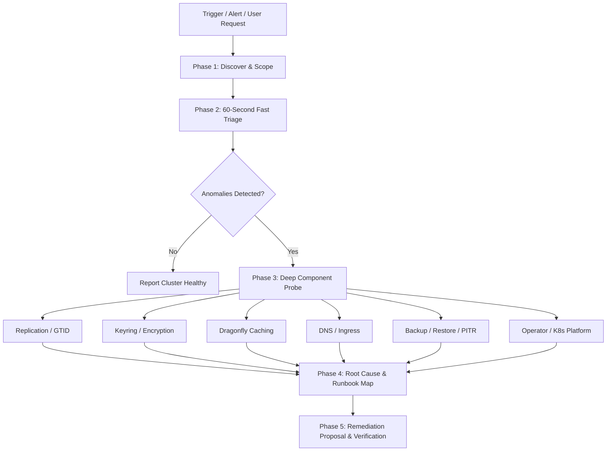

# Bloodraven Doctor (`bloodraven-doctor`)

`bloodraven-doctor` provides systematic, non-destructive diagnosis and actionable remediation for Bloodraven MySQL clusters running in Kubernetes environments.

When an operator or developer encounters issues with a cluster, replication, failover, backup, encryption, or Dragonfly caching, follow this structured runbook.

---

## Safety & Non-Destructive Operation Rules

1. **Read-Only First**: Initial triage and diagnostics MUST ONLY query cluster state, metrics, logs, and sidecar endpoints. Do NOT modify CRDs, trigger promotions, restart pods, or wipe PVCs during investigation without explicit user approval.
2. **First-Party Tools**: Use `kubectl bloodraven <command>` (the official day-2 plugin) wherever applicable (`status`, `promote`, `reclone`, `backup`, `verify-backup`).
3. **Transparent Remediation**: Before executing any state-changing command:
   - State the **Root Cause**.
   - State the **Blast Radius & Downtime Impact**.
   - State the **Data Loss Risk (RPO / RTO)**.
   - Present the exact command and seek user confirmation.
4. **Dynamic Container Resolution**: Never assume fixed container names (e.g. `sidecar` vs `bloodraven-sidecar`). Always discover container names dynamically from `.spec.containers[*].name`. Helper scripts in `scripts/` handle this automatically.

---

## Systematic Diagnostic Workflow



### Phase 1: Discover & Scope

1. Identify the target namespace and `MySQLFailoverGroup` (MFG):
   ```bash
   kubectl get mysqlfailovergroups.shipstream.io -A
   ```
2. If multiple groups exist and the user didn't specify one, ask or list the options.

### Phase 2: The 60-Second Fast Triage

Run the bundled triage script or execute the baseline inspection:

```bash
# Option A: Run the bundled non-destructive triage script
./.agents/skills/bloodraven-doctor/scripts/triage.sh -n <namespace> <group-name>

# Option B: Run native kubectl bloodraven status
kubectl bloodraven status <group-name> -n <namespace>
```

Check the core conditions and status fields:
- `.status.activeSite`: Is there an active primary site?
- `.status.topologyGeneration`: Has authoritative topology changed since the deployment's grant or the start of this investigation? This is durable across restarts, not the CR generation.
- `.status.plannedFailover`: `Deferred/DeploymentHold` means a live deployment hold, not a failed promotion. Inspect `retryAfter` and the message's operation ID and instance.
- `.status.conditions`:
  - `Ready == True`?
  - `Bootstrapping == False`?
  - `RecoveryInProgress == False`?
  - `RecoveryBlocked == False`?
- Pod status: `kubectl get pods -n <namespace> -l app.kubernetes.io/instance=<group-name>`
- Recent events: `kubectl get events -n <namespace> --sort-by=.lastTimestamp`

---

## Phase 3: Deep Component Probes & Symptom Trees

Consult [references/troubleshooting_playbooks.md](./references/troubleshooting_playbooks.md) for step-by-step diagnostic trees.

### 1. Topology & Split-Brain Triage
- **Symptom**: `NoPrimary` (both sites read-only) or multiple sites accepting writes (`read_only=OFF`).
- **Probe**:
  ```bash
  # Check read_only state on all sites
  kubectl get mfg <group-name> -n <namespace> -o jsonpath='{range .status.sites[*]}{.name}{": readOnly="}{.readOnly}{", reachable="}{.reachable}{", role="}{.role}{"\n"}{end}'
  ```
- **Action**: Refer to [Split-Brain Recovery Playbook](./references/troubleshooting_playbooks.md#split-brain--dual-writable-recovery).

### 2. Replication & GTID Divergence
- **Symptom**: High replication lag, `SecondsBehindSource > 0`, replication stopped, or `DivergentTransactionsDetected`.
- **Probe**:
  ```bash
  # Run GTID audit script
  ./.agents/skills/bloodraven-doctor/scripts/gtid-audit.sh -n <namespace> <group-name>
  ```
- **Action**:
  - If replica simply stopped or lagged due to network, restart replication or wait for sync.
  - If GTIDs diverged (errant transactions on old primary): execute safe reclone:
    ```bash
    kubectl bloodraven reclone <group-name> -n <namespace> --target=<divergent-site>
    ```

### 3. Keyring & Data-at-Rest Encryption
- **Symptom**: `KeyringNotSealed`, `KeyringEscrowMissing`, or `KeyringEscrowCorrupt`.
- **Probe**:
  ```bash
  # Probe sidecar keyring status
  ./.agents/skills/bloodraven-doctor/scripts/sidecar-probe.sh -n <namespace> <group-name> keyring
  ```
- **CRITICAL SAFETY RULE**: If `KeyringEscrowMissing` or `KeyringEscrowCorrupt` is detected on a sealed pod, **DO NOT delete, restart, or reschedule the pod**. Recover the escrow Secret first.

### 4. Dragonfly Cache & Session Degradation
- **Symptom**: `status.dragonfly.phase=Degraded`, `DragonflyPromotionFailed`, or active cache service has no endpoints.
- **Probe**:
  ```bash
  kubectl get mfg <group-name> -n <namespace> -o jsonpath='{.status.dragonfly}{"\n"}'
  kubectl get endpoints <group-name>-dragonfly -n <namespace>
  ```
- **Action**: Refer to [Dragonfly Degraded Playbook](./references/troubleshooting_playbooks.md#dragonfly-degradation).

### 5. Backups, PITR Archiver & Verification
- **Symptom**: `BloodravenBackupStale`, failed backup Job, or stale backup verification.
- **Probe**:
  ```bash
  kubectl get mysqlbackups.shipstream.io -n <namespace> --sort-by=.metadata.creationTimestamp
  kubectl get mysqlbackupverifications.shipstream.io -n <namespace>
  ```
- **Action**: Trigger on-demand backup or verification:
  ```bash
  kubectl bloodraven backup <group-name> -n <namespace>
  kubectl bloodraven verify-backup <group-name> -n <namespace>
  ```

### 6. DNS & Application Traffic
- **Symptom**: App writes hitting wrong site, DNS records not updating after failover, or a hostname rename that never reached DNS.
- **Probe**:
  ```bash
  kubectl get mysqlfailovergroup <group> -n <namespace> -o jsonpath='{.spec.dns}{"\n"}'
  kubectl get dnsendpoint -n <namespace> -o jsonpath='{range .items[*]}{.metadata.name}{" "}{.spec.endpoints[0].dnsName}{" -> "}{.spec.endpoints[0].targets[0]}{" ttl="}{.spec.endpoints[0].recordTTL}{"\n"}{end}'
  kubectl logs -n external-dns deploy/external-dns --tail=100
  ```
- **Hostname mismatch**: if `DNSEndpoint.spec.endpoints[0].dnsName` != `spec.dns.hostname`, the operator is not applying the live spec (RBAC/apply failure, or an unpatched operator that cached the name at start). Check operator logs for `DNS reconcile failed` / `DNS reconciled to active site` (`hostname` field). Restarting the operator is only a workaround on versions before the live-spec fix.

---

### 7. Deployment coordination and self-fencing

Run `bash ./.agents/skills/bloodraven-doctor/scripts/deployment-probe.sh <namespace> <group>` for topology, authorized database clients, and projected public fields from durable `coordination.k8s.io/Lease` records. Requires `jq` and read access to MFGs, MysqlDatabases, and Leases. The helper never requests Secrets or outputs lease token hashes. `triage.sh` and `support-bundle.sh` include it. Do not collect raw Lease annotations or request headers.

The optional `/deploy/v1` API runs only on the escrow TLS listener, default `8443`; never use plaintext `8082` or disable certificate checks. It uses projected ServiceAccount TokenReview (audience `bloodraven-deploy` by default) and `MysqlDatabase.spec.deploymentClients`. A `401` is authentication failure; a non-disclosing `403 forbidden` is authorization failure. Compare caller namespace and ServiceAccount with the database assigned to the path group; `instance` is the database CR name. Do not mint a token or impersonate an identity without approval.

For timeouts, inspect `auxiliary.deployAPI.enabled`, `auxiliary.escrowTLS.enabled/existingSecret`, Service endpoints, certificate trust/SANs, and NetworkPolicy. Deployment ingress requires pod label `bloodraven.shipstream.io/deploy-client=true` AND namespace label `shipstream.io/mysql-client=true`. The chart intentionally preserves managed MySQL escrow ingress and metrics/probes/auxiliary ports; custom escrow peers may need `auxiliary.deployAPI.networkPolicy.additionalIngress`.

Renewal `404/409` or a changed topology generation means the deployment must stop; post-DDL uncertainty is manual recovery, never automatic migration retry. A same-operation POST is a mutating idempotent re-grant that rotates the token because storage is hash-only. Never call POST/PUT/DELETE as a diagnostic probe. Leases survive operator restart. Planned failover, ordered update, and restore-in-place defer behind a hold; emergency failover and fencing do not. The approved revoke annotation is `bloodraven.shipstream.io/revoke-deployment-leases=true`, producing `operator_revoked`; request explicit approval and coordinate with all deployment owners before using it. Never delete the leader-election Lease or reset topology generation.

Probe self-fencing using `sidecar-probe.sh ... fencing` (`/status`, field `self_fenced`) and `sidecar-probe.sh ... peer` (`/peer/active-site`). There is no `/fencing` endpoint. `self_fenced` is scoped to the current sidecar process; an empty or false value is not proof that MySQL is writable. With a 60s DNS TTL require `max(configured leaseTimeout, 3s, 3 * effective peerCheckInterval) < 60s`; the peer interval itself is clamped to at least 1s. Defaults 20s/5s produce 20s. Actual fence completion also includes polling, probe, scheduling, and SQL time, so verify margin under faults. Deployment holds never delay this self-fence.

Correlate `DeploymentLeaseRevoked`, `PlannedFailoverDeferred`, lease active/age/revocation/expiry metrics, and `bloodraven_planned_failovers_deferred_total`. Filter request logs on `msg="deploy api"` with `handler, group, instance, namespace, operationId, status, duration_ms`; `duration_ms` is a deliberate exception to camelCase. Keep deployment IDs out of metric labels and all tokens out of bundles.

## Phase 4: Standard Diagnostic Report Format

When reporting findings to the operator, structure your analysis as follows:

```markdown
### 🩺 Bloodraven Cluster Health Report: `<group-name>` (`<namespace>`)

**Overall Status**: 🔴 CRITICAL / 🟡 DEGRADED / 🟢 HEALTHY
**Active Primary**: `<site>` (Writable, GTID: `...`)
**Replica Sites**: `<site>` (Lag: `Xs`, Replicating: `true/false`, ReadOnly: `true`)

#### 🔍 Findings & Root Cause Analysis
- **Primary Issue**: ...
- **Affected Subsystem**: [Topology | Replication | Keyring | Dragonfly | Backups | DNS | Platform]
- **Diagnostic Evidence**: ...

#### 🛠️ Recommended Remediation Plan
1. **Action**: `kubectl bloodraven ...`
2. **Blast Radius**: (e.g., Read-only replica resync; no primary downtime)
3. **Data Loss Risk (RPO)**: (e.g., Zero RPO / Divergent transactions discarded from replica)

*Would you like me to proceed with executing step 1?*
```

---

## Phase 5: Support & Post-Mortem Bundle

If the issue requires escalation or post-incident analysis, generate a sanitized support bundle:

```bash
./.agents/skills/bloodraven-doctor/scripts/support-bundle.sh -n <namespace> <group-name>
```

This captures redacted CR specs, status snapshots, sidecar metrics, and operator logs without leaking sensitive credentials or table data.
