# Bloodraven

[](https://github.com/ShipStream/bloodraven/actions/workflows/ci.yml)
[](https://github.com/ShipStream/bloodraven/actions/workflows/e2e.yml)
[](./LICENSE)

With Bloodraven you can run MySQL async replication failover groups across Kubernetes sites. Bloodraven owns pod creation, MySQL configuration, health monitoring, promotion, DNS steering through external-dns, node taints, clone-based bootstrap, sidecar self-fencing, and optional Dragonfly cache/session sidekicks that follow the active MySQL site.

Bloodraven is built for site-level failover where applications can accept non-zero recovery point objective (RPO) after sudden primary loss. It does not provide synchronous replication, zero RPO, or automatic conflict repair after divergent writes.

**[Documentation](https://bloodraven.dev)** - installation, operations, custom resource definition (CRD) reference, application integration, and more.

### AI Diagnostic Skill (`bloodraven-doctor`)

Install the `bloodraven-doctor` Day-2+ diagnostic skill into your AI agent (Cursor, Claude Code, Antigravity, Windsurf, Roo, etc.):

```bash
npx skills add shipstream/bloodraven
```

## Choose your path

| Goal | Start here |
|---|---|
| Understand licensing and pricing | [Licensing](https://bloodraven.dev/docs/licensing) |
| Try the full demo locally | [Playground](https://bloodraven.dev/docs/get-started/playground) |
| Create a first failover group | [Getting Started](https://bloodraven.dev/docs/get-started/getting-started) |
| Install for production | [Production Install](https://bloodraven.dev/docs/get-started/install-production) |
| Connect an application | [App Integration](https://bloodraven.dev/docs/configuration/app-integration) |
| Troubleshoot with AI Doctor | [Bloodraven Doctor](./skills/bloodraven-doctor/SKILL.md) (`npx skills add shipstream/bloodraven`) |
| Handle an alert | [Operations Overview](https://bloodraven.dev/docs/operations/operations-overview) |
| Configure backups | [Backup Overview](https://bloodraven.dev/docs/backup-and-restore/backup-overview) |

## Standout features

- **Automatic MySQL site failover**: If the active MySQL site dies, Bloodraven promotes another site, moves traffic, updates DNS, and helps the old primary rejoin safely.
- **Split-brain protection**: If two sites might both accept writes, the operator and sidecars fence unsafe MySQL nodes so the cluster does not keep writing in two places.
- **Graceful planned switchover**: An admin can move the primary site with one command; Bloodraven waits for the replica to catch up first, so planned moves can have zero data loss.
- **Backup, restore, PITR, and verification**: Bloodraven can create backups, archive binlogs for point-in-time recovery, encrypt artifacts, restore from them, and test backups by loading them into a throwaway MySQL.
- **Dragonfly cache/session failover**: Bloodraven can manage Dragonfly alongside MySQL, move the active cache/session endpoint during failover, and try to preserve sessions during planned moves.
- **Chaos-tested in CI**: 30+ automated chaos scenarios — primary kills, network partitions, split-brain, self-fencing, data wipes, backup/PITR verification — run against real Kubernetes clusters nightly, and a smoke subset gates every release before artifacts are published. The same [playground](https://bloodraven.dev/docs/get-started/playground) runs locally so you can test these failure modes yourself before you trust them in production.

## Quickstart

The playground deploys a two-site MySQL failover group on k3d, kind, or minikube with Dragonfly co-management enabled, plus a dashboard, counter app, DNS visualization, and chaos tools.

```bash
# Create a local cluster. This example uses k3d.
k3d cluster create bloodraven --agents 2

# Build and deploy the operator, sidecars, MySQL pods, and demo apps.
./playground/setup.sh

# Trigger a simulated site failure.
./playground/chaos.sh kill-site iad

# Remove playground resources.
./playground/teardown.sh
```

See the [Playground guide](https://bloodraven.dev/docs/get-started/playground) for the full walkthrough.

## What Bloodraven manages

- MySQL primary and replica Deployments, Services, ConfigMaps, and persistent volume claims (PVCs).
- Per-site placement, taints, and failover-aware node reactions.
- MySQL clone bootstrap and asynchronous replication.
- Primary promotion, replica reconfiguration, and anti-flap cooldown.
- DNSEndpoint updates for external-dns.
- Optional Dragonfly StatefulSets, Services, replication, promotion, and cache/session continuity status.
- Operator metrics, status endpoints, and WebSocket status broadcasts.
- Backup and restore Jobs for S3 or PVC artifact storage.

## Development

```bash
make help                # Show all available targets

# Build
make build               # Both operator and sidecar
make build-bloodraven    # Operator only
make build-sidecar       # Sidecar only
make docker-build        # Docker images for both
make build-kubectl-plugin    # Build kubectl-bloodraven plugin
make install-kubectl-plugin  # Build and install plugin onto $PATH

# Test
make test                # Fast tests: unit and component
make test-unit           # Unit tests only, with no network listeners
make test-component      # Component tests with fakes
make test-envtest        # envtest controller tests with a real API server
make test-integration    # Integration tests with network listeners

# Code quality
make fmt                 # Format Go source files
make vet                 # Run go vet
make lint                # Run golangci-lint

# Code generation
make generate            # Regenerate deep-copy code
make manifests           # Generate CRD and RBAC manifests
```

### How a new release is published

Bloodraven releases are built from a semantic-version tag. Before creating the tag, update the release-coupled version pins in source, generated CRDs, documentation, and examples. The tag-driven [release workflow](./.github/workflows/README.md#releaseyml--release-automation) then builds and signs both images, packages the Helm chart, and publishes the GitHub release.

For a future release, replace `<VERSION>` with a bare version such as `0.9.2`, then copy and paste this prompt:

```text
Prepare and publish Bloodraven <VERSION> from main. Update the SidecarImage
kubebuilder default in api/v1alpha1/types.go, the version and appVersion in
charts/bloodraven/Chart.yaml, and current-release pins in user-facing docs,
examples, and fixtures. Do not blindly replace historical references or
version-parsing test data.

Run make generate && make manifests, copy config/crd/bases/*.yaml into
charts/bloodraven/crds/, and confirm no previous-release operational pins
remain. Run the full pre-PR gate from AGENTS.md, including the docs build and
envtest because the CRD default changed. Commit the prepared release changes
and get them merged to main. Tag the exact merged commit as v<VERSION>, push
the tag, and monitor the complete Release workflow. Stop and fix any
pre-publish failure; report any post-release E2E failure clearly. When it
finishes, report the GitHub release, image tags and digests, Helm chart
locations, and verification results.
```

### Dependencies

- Go 1.26
- controller-runtime v0.23.3
- k8s.io/api v0.35.3
- MySQL 9.7 LTS with clone plugin
- Optional managed Dragonfly v1.38.0+ (runtime probe reports whether the image advertises `REPLTAKEOVER`)

## Architecture snapshot

When `spec.dragonfly.enabled=true`, Bloodraven adds one Dragonfly sidekick per MySQL site. The active Dragonfly Service follows the Dragonfly master/traffic labels, and the Dragonfly manager keeps its active site aligned with the MySQL failover group. Planned failover waits for target sync and promotes with `REPLTAKEOVER`; emergency failover promotes Dragonfly best-effort and never blocks MySQL recovery.

```mermaid
graph TB
    subgraph "Kubernetes Cluster"
        BR["Bloodraven Controller<br/>:8080 metrics | :8081 probes | :8082 ws/status"]

        subgraph "Site A (for example, iad)"
            D1["Deployment<br/>mysql-main-iad"]
            S1["Sidecar :8080<br/>/health /status /peer/ping"]
            M1[("MySQL Primary<br/>read_only=0")]
            PVC1["PVC<br/>mysql-main-iad-data"]
            SVC1["Service<br/>mysql-main-iad:3306"]
            DFST1["StatefulSet<br/>mysql-main-dragonfly-iad"]
            DF1[("Dragonfly Master<br/>role=master<br/>traffic=enabled")]
            DFSVC1["Service<br/>mysql-main-dragonfly-iad:6379"]
        end

        subgraph "Site B (for example, pdx)"
            D2["Deployment<br/>mysql-main-pdx"]
            S2["Sidecar :8080<br/>/health /status /peer/ping"]
            M2[("MySQL Replica<br/>read_only=1")]
            PVC2["PVC<br/>mysql-main-pdx-data"]
            SVC2["Service<br/>mysql-main-pdx:3306"]
            DFST2["StatefulSet<br/>mysql-main-dragonfly-pdx"]
            DF2[("Dragonfly Replica<br/>REPLICAOF active")]
            DFSVC2["Service<br/>mysql-main-dragonfly-pdx:6379"]
        end

        PSVC["Service: mysql-main-primary<br/>selector: role=primary"]
        RSVC["Service: mysql-main-replicas<br/>selector: role=replica, healthy=yes"]
        DFSVC["Service: mysql-main-dragonfly<br/>selector: dragonfly-role=master<br/>+ dragonfly-traffic=enabled"]
        DFPDB["PodDisruptionBudgets<br/>one per Dragonfly site"]
        CM["ConfigMap: mysql-main-config<br/>my.cnf (GTID, binlog, clone plugin)"]
    end

    subgraph "External"
        CF["DNS (external-dns)<br/>failover A record"]
        WS["Auxiliary apps<br/>WebSocket clients"]
        APP["Applications<br/>MySQL + Dragonfly clients"]
    end

    BR -- "poll read_only" --> M1
    BR -- "poll read_only" --> M2
    BR -- "observe INFO replication" --> DF1
    BR -- "observe INFO replication" --> DF2
    BR -- "REPLICAOF / REPLTAKEOVER" --> DF1
    BR -- "REPLICAOF / REPLTAKEOVER" --> DF2
    BR -- "taint/untaint nodes" --> K8S["Kubernetes API"]
    BR -- "update A record" --> CF
    BR -- "broadcast online/offline" --> WS
    S1 -- "ping peer" --> S2
    S2 -- "ping peer" --> S1
    S1 -- "heartbeat" --> BR
    S2 -- "heartbeat" --> BR
    M2 -- "async replication" --> M1
    DF2 -- "Dragonfly replication" --> DF1

    PSVC --> D1
    RSVC --> D2
    DFSVC1 --> DFST1
    DFSVC2 --> DFST2
    DFSVC --> DFST1
    DFPDB --> DFST1
    DFPDB --> DFST2
    APP --> PSVC
    APP --> DFSVC
```



See the [Architecture](https://bloodraven.dev/docs/architecture/architecture) and [Failover](https://bloodraven.dev/docs/operations/failover) docs for the state machine, failover sequences, and split-brain prevention layers.

## Design decisions

**Deployments, not StatefulSets.** Each site has its own storage class, zone affinity, and role. StatefulSets assume homogeneous replicas -- our pods are fundamentally different (one primary, one replica, different zones). Separate Deployments with `replicas: 1` give us per-site control without fighting StatefulSet semantics.

**Non-HA control plane.** Bloodraven uses leader election but there's no standby. If Bloodraven is down, the MySQL pair continues operating normally. The sidecar self-fencing layer provides safety during controller outages. This is intentional -- the complexity of HA coordination for the controller itself would undermine the "single source of truth" design. See [Operator availability](https://bloodraven.dev/docs/architecture/operator-availability) for the exact behavior during operator-down windows, including what a primary failure during that window looks like to applications.

**DNS flip deferred until confirmed.** After promoting a candidate, Bloodraven doesn't immediately update DNS. It waits for the next poll to confirm `read_only=0` on the promoted site. This prevents pointing DNS at a node that failed promotion.

**Relay log drain is best-effort.** The 30-second drain timeout is non-fatal. If relay logs can't be fully applied, such as after a SQL thread error, failover proceeds anyway. Data in the relay log may be lost, but the alternative -- blocking failover indefinitely -- is worse for availability.

**Anti-flap cooldown.** After a failover, further failovers are blocked for 5 minutes by default (configurable via `failoverCooldown`). This prevents cascading failovers when infrastructure is unstable.

## License

Bloodraven is **source-available**, not open source. It is licensed under the [Business Source License 1.1](./LICENSE), which is not OSI-approved, so we do not call it open source.

**Free, no license required:**

- All non-production use — dev, test, staging, CI, evaluation, demo — at any scale, forever.
- Production use by individuals, non-commercial users, non-profits, and companies under $1M annual revenue.

**Requires a one-time commercial license:** production use by companies over $1M annual revenue. $990 per failover group, or $4,900 for unlimited groups across your organization. Perpetual, with 12 months of updates included; renewal is optional and you keep every version published while your update period was active. See [pricing](https://bloodraven.dev/docs/licensing) and [commercial terms](./LICENSE-COMMERCIAL.md).

**Every version converts to Apache 2.0 two years after publication.** That is written into the license as the Change Date and cannot be revoked, so code you depend on cannot be taken away from you.

There is no license server, activation, feature gating, or phone-home. The software is fully functional without a key. Compliance is on the honor system.

Contributions are welcome from everyone — see [CONTRIBUTING.md](./CONTRIBUTING.md) and the [CLA](./CLA.md). Licensing questions: licensing@shipstream.io
