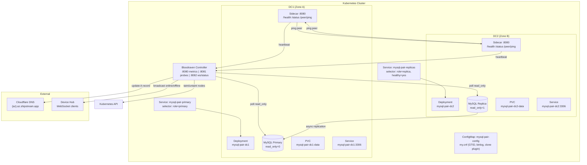
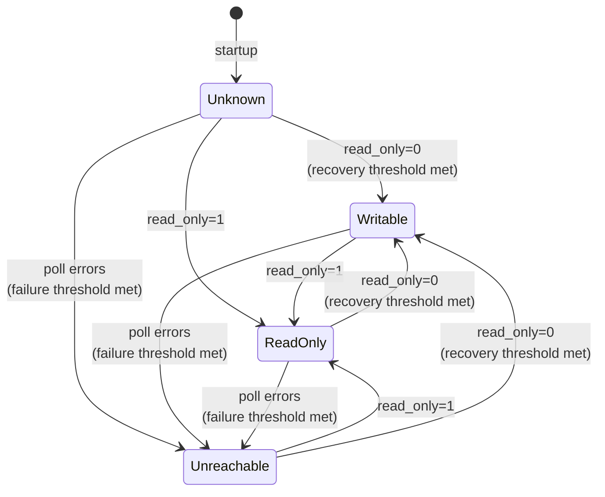
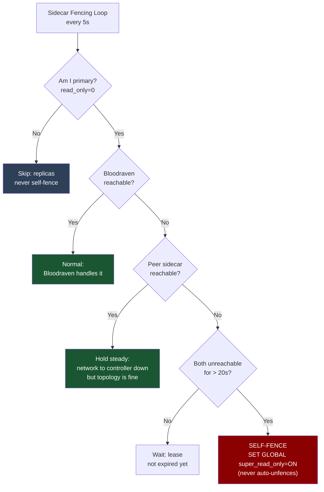
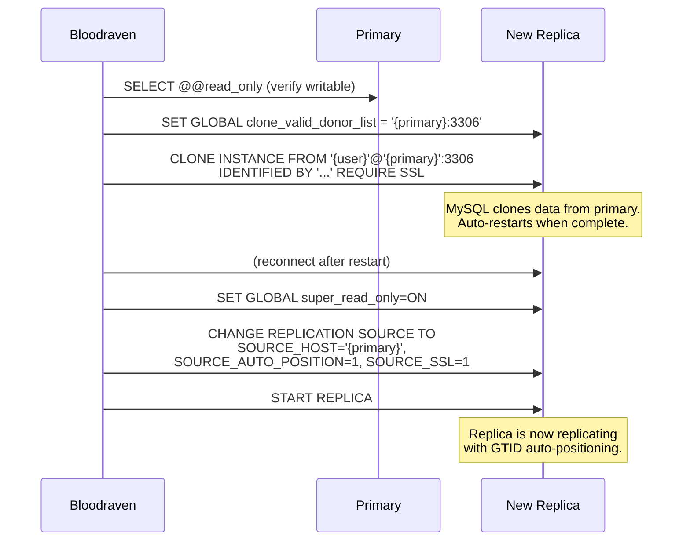
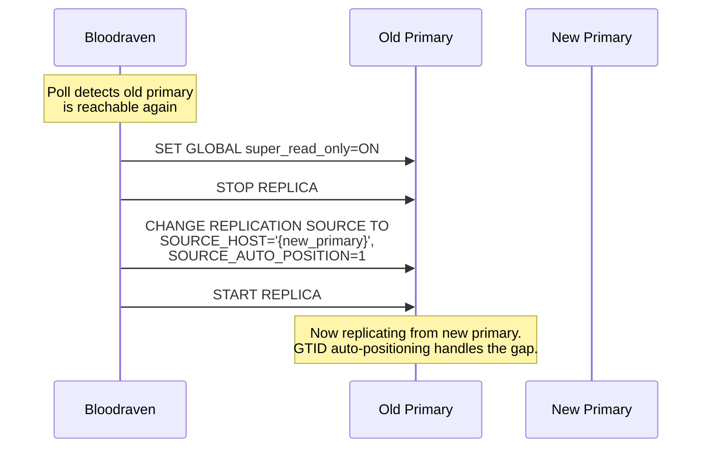

# Bloodraven

A Kubernetes operator for MySQL async replication pairs across two datacenters. Bloodraven owns the full MySQL lifecycle: pod creation, configuration, health monitoring, automated failover, clone-based bootstrapping, and platform reactions (node taints, Cloudflare DNS, Device Hub websockets).

Single controller, single source of truth, no coordination problems.

## Installation

### Helm

```bash
helm install bloodraven charts/bloodraven/ \
  --namespace shared-az1 \
  --create-namespace
```

Override defaults with `--set` or a values file:

```bash
helm install bloodraven charts/bloodraven/ \
  --namespace shared-az1 \
  --set metrics.serviceMonitor.enabled=true \
  --set image.tag=v0.2.0
```

The chart installs:

| Resource | Purpose |
|---|---|
| CRD (`MysqlFailoverGroup`) | Installed from `crds/` before templates |
| ServiceAccount | Identity for the operator pod |
| ClusterRole + Binding | RBAC for reconciler, node tainting, leader election |
| Deployment | Single-replica operator on control-plane nodes |
| Service (`-metrics`) | Prometheus scrape target (`:8080`) |
| Service (auxiliary) | Status API + WebSocket for sidecars (`:8082`) |
| ServiceMonitor | Optional, for Prometheus Operator (`metrics.serviceMonitor.enabled`) |

After installing, create a `MysqlFailoverGroup` CR to start managing a MySQL pair -- see [Custom Resource](#custom-resource) below.

### Manual

```bash
# Build
make build
docker build --target bloodraven -t bloodraven .
docker build --target sidecar -t bloodraven-sidecar .

# Apply CRD and RBAC
kubectl apply -f config/crd/bases/
kubectl apply -f config/rbac/
```

## Architecture



## Failover Workflow

When a primary becomes unreachable, Bloodraven orchestrates a controlled failover with relay log draining, fencing, and deferred DNS confirmation.

```mermaid
sequenceDiagram
    participant BR as Bloodraven
    participant OP as Old Primary (DC1)
    participant NP as New Primary (DC2)
    participant DNS as Cloudflare DNS
    participant DH as Device Hub

    Note over BR: Poll detects DC1 unreachable<br/>(3 consecutive failures)

    BR->>BR: State: DC1 writable -> unreachable
    BR->>DH: broadcast {dc1: "offline"}
    BR->>K8S: taint DC1 zone nodes (NoExecute)

    Note over BR: Cross-DC eval: DC1=unreachable, DC2=read-only<br/>-> promote DC2

    BR->>BR: Check anti-flap cooldown (60m)

    rect rgb(40, 40, 60)
        Note over BR,NP: Failover Sequence
        BR->>OP: SET GLOBAL super_read_only=ON
        Note right of OP: May fail (unreachable) -- that's OK
        BR->>NP: WaitForRelayLogDrain (30s timeout)
        BR->>NP: STOP REPLICA
        BR->>NP: RESET REPLICA ALL
        BR->>NP: SET GLOBAL super_read_only=OFF
        BR->>NP: SET GLOBAL read_only=0
    end

    Note over BR: promotedDC = "dc2"<br/>DNS flip deferred until confirmed

    BR->>BR: Next poll: DC2 read_only=0 confirmed
    BR->>BR: State: DC2 read-only -> writable<br/>(after recovery threshold)
    BR->>DH: broadcast {dc2: "online"}
    BR->>K8S: untaint DC2 zone nodes
    BR->>DNS: Update A record -> DC2 LB IP
    BR->>BR: promotedDC = "" (cleared)
```



## State Machine

Each DC is independently tracked through four states with debounced transitions.



### Debounce Logic

Transitions are debounced to prevent flapping on transient failures:

| Event | Counter | Threshold | Behavior |
|---|---|---|---|
| Poll error | `failCount++` | `failureThreshold` (default 3) | State unchanged until threshold reached |
| Poll success, `read_only=1` | Reset all counters | Immediate | Transition to ReadOnly immediately |
| Poll success, `read_only=0` | `recoveryCount++` | `recoveryThreshold` (default 2) | State unchanged until threshold reached |

With a 2-second poll interval (default), unreachable detection takes ~6 seconds and recovery confirmation takes ~4 seconds.

### Cross-DC State Matrix

When a state transition occurs, the combined state of both DCs is evaluated:

| DC1 | DC2 | Action |
|---|---|---|
| **unreachable** | **read-only** | Promote DC2, flip DNS |
| **read-only** | **unreachable** | Promote DC1, flip DNS |
| writable | unreachable | Alert: replica down |
| unreachable | writable | Alert: replica down |
| writable | writable | Alert: SPLIT BRAIN |
| read-only | read-only | Alert: NO PRIMARY |
| unreachable | unreachable | Alert: TOTAL LOSS |

## Sidecar Self-Fencing

Each MySQL pod runs a sidecar that can self-fence the primary if it becomes network-partitioned from both Bloodraven and its peer. This is a safety net -- Bloodraven handles all normal failover.



### Why 20 Seconds?

The lease timeout (20s) is deliberately longer than Bloodraven's failure detection window (3 polls x 2s = 6s). This gives Bloodraven first shot at handling the failure. The sidecar only self-fences if Bloodraven itself is also partitioned.

**Split-brain window:** ~14 seconds (from T=6s when Bloodraven promotes, to T=20s when old primary self-fences). Mitigated by application-layer `SELECT @@read_only` checks.

## Five-Layer Split-Brain Prevention

1. **Remote fencing:** Bloodraven sets `super_read_only=ON` on old primary before promoting candidate
2. **Self-fencing:** Sidecar sets `super_read_only=ON` when partitioned from both Bloodraven and peer
3. **Startup safety net:** Sidecar checks on boot -- if not the designated primary DC but `read_only=OFF`, forces `super_read_only=ON`
4. **Service routing:** Primary Service selector requires `shipstream.io/role=primary` label; replicas are relabeled before primary to prevent dual-primary windows
5. **Conservative promotion:** Only `unreachable + read-only` triggers failover. `unreachable + writable` only alerts (primary may still be serving)

## Bootstrap (Clone Plugin)

New or replacement replicas are seeded using MySQL's clone plugin:



## Old Primary Recovery

When a failed primary comes back online, Bloodraven reconfigures it as a replica:



## Custom Resource

```yaml
apiVersion: shipstream.io/v1alpha1
kind: MysqlFailoverGroup
metadata:
  name: main
  namespace: mysql
spec:
  image: mysql:9.6
  sidecarImage: ghcr.io/shipstream/bloodraven-sidecar:latest

  sites:
    - name: iad
      zone: us-east-1a
      lbIP: 10.0.1.100
      storage:
        storageClassName: gp3-iad
        size: 100Gi
      resources:
        requests:
          cpu: "2"
          memory: 8Gi
        limits:
          cpu: "4"
          memory: 16Gi
    - name: pdx
      zone: us-west-2a
      lbIP: 10.0.2.100
      storage:
        storageClassName: gp3-pdx
        size: 100Gi
      resources:
        requests:
          cpu: "2"
          memory: 8Gi

  secretName: mysql-credentials
  az: lion

  cloudflare:
    apiTokenSecretRef:
      name: cloudflare-token
      key: api-token
    zoneID: abc123

  tls:
    issuerRef:
      name: letsencrypt-prod
      kind: ClusterIssuer

  pollInterval: 2s
  failureThreshold: 3
  recoveryThreshold: 2
  failoverCooldown: 60m

  sidecar:
    leaseTimeout: 20s
    peerCheckInterval: 5s

  mysqlConf:
    innodb-buffer-pool-size: "4G"
    max-connections: "1000"
```

### Status

```yaml
status:
  activeSite: iad
  sites:
    - name: iad
      state: writable
      lastSeen: "2026-04-07T12:00:00Z"
      gtidExecuted: "3E11FA47-71CA-11E1-9E33-C80AA9429562:1-77"
      replicating: false
    - name: pdx
      state: read-only
      lastSeen: "2026-04-07T12:00:00Z"
      gtidExecuted: "3E11FA47-71CA-11E1-9E33-C80AA9429562:1-77"
      replicating: true
      secondsBehindSource: 0
  lastFailover: "2026-04-01T08:30:00Z"
  lastFailoverTarget: pdx
  conditions:
    - type: Ready
      status: "True"
      reason: TopologyPolled
      message: "At least one site is writable and replication is healthy"
    - type: Degraded
      status: "False"
      reason: Healthy
      message: "No cross-site alerts"
```

## Kubernetes Resources Created

Per `MysqlFailoverGroup`, the reconciler creates:

| Resource | Name | Per-DC | Notes |
|---|---|---|---|
| ConfigMap | `mysql-{pair}-config` | No | Generated `my.cnf` with GTID, binlog, clone plugin |
| PVC | `mysql-{pair}-{dc}-data` | Yes | `ReadWriteOnce`, DC-specific storage class |
| Deployment | `mysql-{pair}-{dc}` | Yes | `replicas: 1`, `Recreate` strategy, zone affinity |
| Service | `mysql-{pair}-{dc}` | Yes | `ClusterIP`, direct access to specific DC |
| Service | `mysql-{pair}-primary` | No | Selector: `shipstream.io/role=primary` |
| Service | `mysql-{pair}-replicas` | No | Selector: `shipstream.io/role=replica, healthy=yes` |

## Platform Reactions

| Trigger | Action | Detail |
|---|---|---|
| DC becomes non-writable | **Taint nodes** | `shipstream.io/db-readonly=true:NoExecute` on all nodes in the DC's zone |
| DC becomes writable | **Untaint nodes** | Remove taint from zone nodes |
| Promotion confirmed | **DNS flip** | Update Cloudflare A record `{az}.az.shipstream.app` to new primary's LB IP (60s TTL) |
| Any state change | **WebSocket broadcast** | `{"dc": "dc1", "status": "offline"}` to all connected Device Hub clients |

## Metrics

All metrics use the `bloodraven_` prefix.

| Metric | Type | Labels | Description |
|---|---|---|---|
| `bloodraven_poll_latency_seconds` | Histogram | `dc` | MySQL poll round-trip time |
| `bloodraven_state_transitions_total` | Counter | `dc`, `from`, `to` | State transition count |
| `bloodraven_taint_operations_total` | Counter | `dc`, `action` | Node taint apply/remove count |
| `bloodraven_dns_flips_total` | Counter | `dc` | Cloudflare DNS update count |
| `bloodraven_websocket_clients` | Gauge | | Connected WebSocket clients |

## Ports

| Port | Component | Purpose |
|---|---|---|
| `:8080` | Controller | Prometheus metrics (controller-runtime) |
| `:8081` | Controller | Health (`/healthz`) and readiness (`/readyz`) probes |
| `:8082` | Controller | Auxiliary HTTP: `/status`, `/ws/status` |
| `:8080` | Sidecar | `/health`, `/status`, `/peer/ping` |
| `:3306` | MySQL | MySQL protocol |

## Network Assumptions

The auxiliary HTTP server on `:8082` exposes `/ws/status` for Device Hub websocket connections and `/status` for topology state. The current security posture assumes:

- **Internal-only service**: The auxiliary server is exposed as a `ClusterIP` service with no ingress. It is not reachable from outside the cluster.
- **Trusted cluster boundary**: All workloads in the cluster are trusted. There are no multi-tenant workloads sharing the cluster.
- **No origin checks**: The websocket upgrader accepts all origins (`CheckOrigin` returns `true`). This is safe because browser-origin protections only matter when the endpoint is reachable from outside the trust boundary.

If any of the following change, add authentication or origin restrictions:

- The websocket endpoint is exposed through an ingress or load balancer.
- Multi-tenant workloads share the cluster.
- The hub begins carrying higher-sensitivity data or control actions.

## Development

```bash
make help                # Show all available targets

# Build
make build               # Both operator and sidecar
make build-bloodraven    # Operator only
make build-sidecar       # Sidecar only
make docker-build        # Docker images for both

# Test
make test                # All tests (unit + integration)
make test-unit           # Unit tests only (no network listeners)
make test-integration    # Integration tests only

# Code quality
make fmt                 # Format Go source files
make vet                 # Run go vet
make lint                # Run golangci-lint

# Code generation
make generate            # Regenerate deep copy code
make manifests           # Generate CRD and RBAC manifests
```

### Dependencies

- Go 1.25
- controller-runtime v0.23.3
- k8s.io/api v0.35.0
- MySQL 9.6 with clone plugin

## Design Decisions

**Deployments, not StatefulSets.** Each DC has its own storage class, zone affinity, and role. StatefulSets assume homogeneous replicas -- our pods are fundamentally different (one primary, one replica, different zones). Separate Deployments with `replicas: 1` give us per-DC control without fighting StatefulSet semantics.

**Non-HA control plane.** Bloodraven uses leader election but there's no standby. If Bloodraven is down, the MySQL pair continues operating normally. The sidecar self-fencing layer provides safety during controller outages. This is intentional -- the complexity of HA coordination for the controller itself would undermine the "single source of truth" design.

**DNS flip deferred until confirmed.** After promoting a candidate, Bloodraven doesn't immediately update DNS. It waits for the next poll to confirm `read_only=0` on the promoted DC. This prevents pointing DNS at a node that failed promotion.

**Relay log drain is best-effort.** The 30-second drain timeout is non-fatal. If relay logs can't be fully applied (e.g., SQL thread error), failover proceeds anyway. Data in the relay log may be lost, but the alternative -- blocking failover indefinitely -- is worse for availability.

**Anti-flap cooldown.** After a failover, further failovers are blocked for 60 minutes (configurable). This prevents cascading failovers when infrastructure is unstable.
