# Bloodraven

With Bloodraven you can run MySQL async replication failover groups across Kubernetes sites. Bloodraven owns pod creation, MySQL configuration, health monitoring, promotion, DNS steering through external-dns, node taints, clone-based bootstrap, sidecar self-fencing, and optional Dragonfly cache/session sidekicks that follow the active MySQL site.

Bloodraven is built for site-level failover where applications can accept non-zero recovery point objective (RPO) after sudden primary loss. It does not provide synchronous replication, zero RPO, or automatic conflict repair after divergent writes.

**[Documentation](https://bloodraven.readthedocs.io/en/latest/)** - installation, operations, custom resource definition (CRD) reference, application integration, and more.

## Choose your path

| Goal | Start here |
|---|---|
| Try the full demo locally | [Playground](https://bloodraven.readthedocs.io/en/latest/docs/playground) |
| Create a first failover group | [Getting Started](https://bloodraven.readthedocs.io/en/latest/docs/getting-started) |
| Install for production | [Production Install](https://bloodraven.readthedocs.io/en/latest/docs/install-production) |
| Connect an application | [App Integration](https://bloodraven.readthedocs.io/en/latest/docs/app-integration) |
| Handle an alert | [Operations Overview](https://bloodraven.readthedocs.io/en/latest/docs/operations-overview) |
| Configure backups | [Backup Overview](https://bloodraven.readthedocs.io/en/latest/docs/backup-overview) |

## Quickstart

The playground deploys a two-site MySQL failover group on k3d, kind, or minikube with Dragonfly co-management enabled, plus a dashboard, counter app, DNS visualization, and chaos tools.

```bash
# Create a local cluster. This example uses k3d.
k3d cluster create bloodraven --agents 2

# Build and deploy the operator, sidecars, MySQL pods, and demo apps.
./playground/setup.sh

# Trigger a simulated site failure.
./playground/chaos.sh kill-site iad

# Remove playground resources.
./playground/teardown.sh
```

See the [Playground guide](https://bloodraven.readthedocs.io/en/latest/docs/playground) for the full walkthrough.

## What Bloodraven manages

- MySQL primary and replica Deployments, Services, ConfigMaps, and persistent volume claims (PVCs).
- Per-site placement, taints, and failover-aware node reactions.
- MySQL clone bootstrap and asynchronous replication.
- Primary promotion, replica reconfiguration, and anti-flap cooldown.
- DNSEndpoint updates for external-dns.
- Optional Dragonfly StatefulSets, Services, replication, promotion, and cache/session continuity status.
- Operator metrics, status endpoints, and WebSocket status broadcasts.
- Backup and restore Jobs for S3 or PVC artifact storage.

## Development

```bash
make help                # Show all available targets

# Build
make build               # Both operator and sidecar
make build-bloodraven    # Operator only
make build-sidecar       # Sidecar only
make docker-build        # Docker images for both

# Test
make test                # Fast tests: unit and component
make test-unit           # Unit tests only, with no network listeners
make test-component      # Component tests with fakes
make test-envtest        # envtest controller tests with a real API server
make test-integration    # Integration tests with network listeners

# Code quality
make fmt                 # Format Go source files
make vet                 # Run go vet
make lint                # Run golangci-lint

# Code generation
make generate            # Regenerate deep-copy code
make manifests           # Generate CRD and RBAC manifests
```

### Dependencies

- Go 1.26
- controller-runtime v0.23.3
- k8s.io/api v0.35.3
- MySQL 9.6 with clone plugin
- Optional managed Dragonfly v1.38.0+

## Architecture snapshot

When `spec.dragonfly.enabled=true`, Bloodraven adds one Dragonfly sidekick per MySQL site. The active Dragonfly Service follows the Dragonfly master/traffic labels, and the Dragonfly manager keeps its active site aligned with the MySQL failover group. Planned failover waits for target sync and promotes with `REPLTAKEOVER`; emergency failover promotes Dragonfly best-effort and never blocks MySQL recovery.

```mermaid
graph TB
    subgraph "Kubernetes Cluster"
        BR["Bloodraven Controller<br/>:8080 metrics | :8081 probes | :8082 ws/status"]

        subgraph "Site A (for example, iad)"
            D1["Deployment<br/>mysql-main-iad"]
            S1["Sidecar :8080<br/>/health /status /peer/ping"]
            M1[("MySQL Primary<br/>read_only=0")]
            PVC1["PVC<br/>mysql-main-iad-data"]
            SVC1["Service<br/>mysql-main-iad:3306"]
            DFST1["StatefulSet<br/>mysql-main-dragonfly-iad"]
            DF1[("Dragonfly Master<br/>role=master<br/>traffic=enabled")]
            DFSVC1["Service<br/>mysql-main-dragonfly-iad:6379"]
        end

        subgraph "Site B (for example, pdx)"
            D2["Deployment<br/>mysql-main-pdx"]
            S2["Sidecar :8080<br/>/health /status /peer/ping"]
            M2[("MySQL Replica<br/>read_only=1")]
            PVC2["PVC<br/>mysql-main-pdx-data"]
            SVC2["Service<br/>mysql-main-pdx:3306"]
            DFST2["StatefulSet<br/>mysql-main-dragonfly-pdx"]
            DF2[("Dragonfly Replica<br/>REPLICAOF active")]
            DFSVC2["Service<br/>mysql-main-dragonfly-pdx:6379"]
        end

        PSVC["Service: mysql-main-primary<br/>selector: role=primary"]
        RSVC["Service: mysql-main-replicas<br/>selector: role=replica, healthy=yes"]
        DFSVC["Service: mysql-main-dragonfly<br/>selector: dragonfly-role=master<br/>+ dragonfly-traffic=enabled"]
        DFPDB["PodDisruptionBudgets<br/>one per Dragonfly site"]
        CM["ConfigMap: mysql-main-config<br/>my.cnf (GTID, binlog, clone plugin)"]
    end

    subgraph "External"
        CF["DNS (external-dns)<br/>failover A record"]
        WS["Auxiliary apps<br/>WebSocket clients"]
        APP["Applications<br/>MySQL + Dragonfly clients"]
    end

    BR -- "poll read_only" --> M1
    BR -- "poll read_only" --> M2
    BR -- "observe INFO replication" --> DF1
    BR -- "observe INFO replication" --> DF2
    BR -- "REPLICAOF / REPLTAKEOVER" --> DF1
    BR -- "REPLICAOF / REPLTAKEOVER" --> DF2
    BR -- "taint/untaint nodes" --> K8S["Kubernetes API"]
    BR -- "update A record" --> CF
    BR -- "broadcast online/offline" --> WS
    S1 -- "ping peer" --> S2
    S2 -- "ping peer" --> S1
    S1 -- "heartbeat" --> BR
    S2 -- "heartbeat" --> BR
    M2 -- "async replication" --> M1
    DF2 -- "Dragonfly replication" --> DF1

    PSVC --> D1
    RSVC --> D2
    DFSVC1 --> DFST1
    DFSVC2 --> DFST2
    DFSVC --> DFST1
    DFPDB --> DFST1
    DFPDB --> DFST2
    APP --> PSVC
    APP --> DFSVC
```



See the [Architecture](https://bloodraven.readthedocs.io/en/latest/docs/architecture) and [Failover](https://bloodraven.readthedocs.io/en/latest/docs/failover) docs for the state machine, failover sequences, and split-brain prevention layers.

## Design decisions

**Deployments, not StatefulSets.** Each site has its own storage class, zone affinity, and role. StatefulSets assume homogeneous replicas -- our pods are fundamentally different (one primary, one replica, different zones). Separate Deployments with `replicas: 1` give us per-site control without fighting StatefulSet semantics.

**Non-HA control plane.** Bloodraven uses leader election but there's no standby. If Bloodraven is down, the MySQL pair continues operating normally. The sidecar self-fencing layer provides safety during controller outages. This is intentional -- the complexity of HA coordination for the controller itself would undermine the "single source of truth" design. See [Operator availability](./docs/docs/operator-availability.mdx) for the exact behavior during operator-down windows, including what a primary failure during that window looks like to applications.

**DNS flip deferred until confirmed.** After promoting a candidate, Bloodraven doesn't immediately update DNS. It waits for the next poll to confirm `read_only=0` on the promoted site. This prevents pointing DNS at a node that failed promotion.

**Relay log drain is best-effort.** The 30-second drain timeout is non-fatal. If relay logs can't be fully applied, such as after a SQL thread error, failover proceeds anyway. Data in the relay log may be lost, but the alternative -- blocking failover indefinitely -- is worse for availability.

**Anti-flap cooldown.** After a failover, further failovers are blocked for 5 minutes by default (configurable via `failoverCooldown`). This prevents cascading failovers when infrastructure is unstable.
