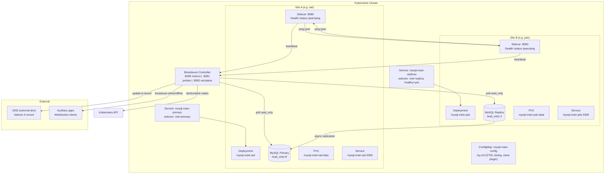

# Bloodraven

A Kubernetes operator for MySQL async replication failover groups across two or more sites. Bloodraven owns the full MySQL lifecycle: pod creation, configuration, health monitoring, automated failover between primary candidates (with optional DR-only followers), clone-based bootstrapping, and platform reactions (node taints, DNS failover via external-dns, WebSocket broadcasts).

Single controller, single source of truth, no coordination problems.

**[Documentation](https://bloodraven.readthedocs.io/en/latest/)** -- installation, operations, CRD reference, app integration, and more.

## Architecture



See the [Architecture](https://bloodraven.readthedocs.io/en/latest/docs/architecture) and [Failover](https://bloodraven.readthedocs.io/en/latest/docs/failover) docs for the state machine, failover sequences, and split-brain prevention layers.

## Playground

Try Bloodraven locally with a single command. The playground spins up a full two-site MySQL failover group on k3d, kind, or minikube — complete with a real-time dashboard, a counter app for testing writes, DNS visualization, and a chaos monkey for triggering failovers.

```bash
# Create a local cluster (k3d example)
k3d cluster create bloodraven --agents 2

# Build and deploy everything
./playground/setup.sh

# Trigger chaos
./playground/chaos.sh kill-site iad

# Tear it down
./playground/teardown.sh
```

See the [Playground guide](https://bloodraven.readthedocs.io/en/latest/docs/playground) for the full walkthrough.

## Development

```bash
make help                # Show all available targets

# Build
make build               # Both operator and sidecar
make build-bloodraven    # Operator only
make build-sidecar       # Sidecar only
make docker-build        # Docker images for both

# Test
make test                # Fast tests (unit + component)
make test-unit           # Unit tests only (no network listeners)
make test-component      # Component tests (cross-package with fakes)
make test-envtest        # envtest controller tests (real API server)
make test-integration    # Integration tests (network listeners)

# Code quality
make fmt                 # Format Go source files
make vet                 # Run go vet
make lint                # Run golangci-lint

# Code generation
make generate            # Regenerate deep copy code
make manifests           # Generate CRD and RBAC manifests
```

### Dependencies

- Go 1.26
- controller-runtime v0.23.3
- k8s.io/api v0.35.3
- MySQL 9.6 with clone plugin

## Design Decisions

**Deployments, not StatefulSets.** Each site has its own storage class, zone affinity, and role. StatefulSets assume homogeneous replicas -- our pods are fundamentally different (one primary, one replica, different zones). Separate Deployments with `replicas: 1` give us per-site control without fighting StatefulSet semantics.

**Non-HA control plane.** Bloodraven uses leader election but there's no standby. If Bloodraven is down, the MySQL pair continues operating normally. The sidecar self-fencing layer provides safety during controller outages. This is intentional -- the complexity of HA coordination for the controller itself would undermine the "single source of truth" design. See [Operator availability](./docs/docs/operator-availability.mdx) for the exact behavior during operator-down windows, including what a primary failure during that window looks like to applications.

**DNS flip deferred until confirmed.** After promoting a candidate, Bloodraven doesn't immediately update DNS. It waits for the next poll to confirm `read_only=0` on the promoted site. This prevents pointing DNS at a node that failed promotion.

**Relay log drain is best-effort.** The 30-second drain timeout is non-fatal. If relay logs can't be fully applied (e.g., SQL thread error), failover proceeds anyway. Data in the relay log may be lost, but the alternative -- blocking failover indefinitely -- is worse for availability.

**Anti-flap cooldown.** After a failover, further failovers are blocked for 5 minutes by default (configurable via `failoverCooldown`). This prevents cascading failovers when infrastructure is unstable.
