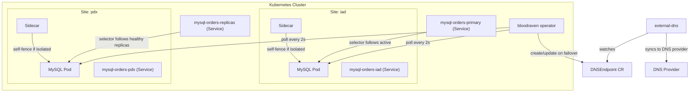

# Architecture

Bloodraven manages MySQL async replication failover groups. Each `MysqlFailoverGroup` resource describes **two or more sites**, each running a MySQL pod with a sidecar container. Sites carry explicit roles — `primary-candidate` (promotable on failover) or `dr-only` (passive replica) — and at least two primary-candidate sites are required so an active primary always has a promotion target. The operator continuously polls every site and takes corrective action when the topology deviates from the desired state.

Bloodraven uses a **star replication topology**: one site is the active primary, and every other site replicates from it. There are no replication chains. See [Multi-site topology](./multi-site.mdx) for the full role model and sizing guidance.

## High-level overview

## Operator (`bloodraven`)

The operator runs as a single-replica Deployment with controller-runtime
leader election enabled as a safety belt. See
[Operator availability](./operator-availability.mdx) for the complete
breakdown of what happens — and what doesn't — when the operator is
down. For each `MysqlFailoverGroup`, it:

1. Creates a StatefulSet-style Pod, Service, and PVC per site
2. Creates a `mysql-<name>-primary` Service whose selector tracks the active site
3. Creates a `mysql-<name>-replicas` Service whose selector matches healthy read replicas
4. Runs a polling loop (default 2s) that connects to each site's MySQL instance and evaluates the replication topology
5. Applies the [state machine](./failover.mdx#state-machine) logic to decide whether to failover, alert, or do nothing
6. On failover, executes the [failover sequence](./failover.mdx#failover-sequence) including DNSEndpoint updates and node tainting

The operator exposes:
- **Prometheus metrics** on `:8080/metrics`
- **Health probes** on an auxiliary port
- **Status API** on `:8082` (`GET /status`, `GET /active-site`, `GET /ws/status`)

## Sidecar (`bloodraven-sidecar`)

Each MySQL pod includes a sidecar container that:

- Responds to health and readiness probes
- Monitors connectivity to both the operator and **every peer site** (the sidecar is given a comma-separated list of peer sidecar addresses at pod-spec time)
- **Self-fences on topology mismatch**: every `peerCheckInterval` tick the sidecar polls the operator's `GET /active-site` endpoint. If the operator-authoritative active site is a different site than this one and MySQL is still writable, the sidecar fences immediately regardless of lease timing. When the operator is unreachable to this sidecar but reachable to a peer, the sidecar also reads the peer's cached view via `GET /peer/active-site` and adopts it when strictly newer than its own. This closes the gap where a stale primary returns after a failover: even if the peer is reachable (so the lease-only rule would never fire), the mismatched `activeSite` triggers an immediate fence.
- **Self-fences on full isolation** as a backstop: if the operator AND every peer are unreachable for `leaseTimeout` (default `20s`), it sets `SET GLOBAL super_read_only=ON` on its local MySQL instance. A single reachable peer is enough to keep the primary writable under this rule.
- **Startup safety net**: on boot, queries the operator's `GET /active-site` endpoint to determine the current active site. The sidecar fences MySQL first and only clears `super_read_only` if the operator confirms this is the active site; the answer also seeds the shared topology cache so `/peer/active-site` is usable from tick zero.
- **Binlog archiver (PITR)**: when `spec.backup.pitr.enabled=true`, a goroutine watches `mysql-bin.index` via inotify and uploads each sealed binlog to the referenced backup profile's storage. Only the primary uploads (gated on `@@read_only`); after a failover the new primary's archiver takes over within one scan cycle. Archived files are pruned once the oldest retained `MysqlBackup` moves past them, using a cutoff timestamp pulled from the operator's `/pitr-cutoff` endpoint. See [Backup and restore → PITR](/docs/backup-restore#point-in-time-recovery-pitr).

This self-fencing behavior is a critical safety net. Even if the operator is down, an isolated MySQL instance will not accept writes that could diverge from the other site. The full timing of operator-down + primary-failure is documented in [Operator availability](./operator-availability.mdx#operator-down--primary-failure).

Architectural note: the archiver runs in the sidecar rather than the operator because inotify + direct binlog file reads need the MySQL data PVC mounted. PVCs are typically `ReadWriteOnce` and bound to one node, so a centralized archiver in the operator pod can't mount every failover group's data volume. The sidecar is already per-pod and already knows its local MySQL's role, so it's the natural home.

## Services

Each `MysqlFailoverGroup` named `orders` produces these Services:

| Service | Purpose |
|---|---|
| `mysql-orders-iad` | Direct access to the `iad` site MySQL instance |
| `mysql-orders-pdx` | Direct access to the `pdx` site MySQL instance |
| `mysql-orders-primary` | Follows the active primary. Apps connect here for writes. |
| `mysql-orders-replicas` | Matches healthy read replicas. Apps connect here for reads. |

The `-primary` and `-replicas` Services use label selectors that the operator updates when the topology changes. See [App Integration](./app-integration.mdx) for connection details.

## PodDisruptionBudget

Each failover group gets a `PodDisruptionBudget` named `mysql-<name>` with `minAvailable: 1`. This ensures at least one MySQL instance remains running during voluntary disruptions such as node drains and cluster upgrades.

When `spec.dragonfly.enabled` is true, the operator also creates a group-level Dragonfly `PodDisruptionBudget` named `<name>-dragonfly` with `minAvailable: 1`, selecting all Bloodraven-managed Dragonfly pods for the group. This does not make Dragonfly durable, but it avoids voluntary disruptions taking every cache/session pod down at once.

## Labels

All resources managed by the operator carry a standard set of labels:

| Label | Value |
|---|---|
| `app.kubernetes.io/name` | `mysql` |
| `app.kubernetes.io/instance` | `<failover-group-name>` |
| `shipstream.io/failover-group` | `<failover-group-name>` |
| `shipstream.io/site` | `<site-name>` |
| `app.kubernetes.io/managed-by` | `bloodraven` |

Pods receive additional labels:

| Label | Value |
|---|---|
| `shipstream.io/role` | `primary` or `replica` |
| `shipstream.io/healthy` | `yes` or `no` |

These labels drive Service selectors and can be used for monitoring queries and policy rules.

## Replication topology

Bloodraven uses MySQL asynchronous replication with GTID-based positioning. At any given time:

- One site is the **primary** (`read_only=0`, `super_read_only=0`) and accepts writes
- The other site is the **replica** (`read_only=1`) and replicates from the primary

The operator does not configure multi-source replication or group replication. It manages a simple primary-replica pair and handles promotion and demotion through direct SQL commands.
