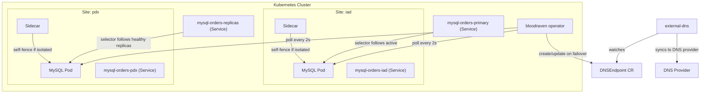

# Architecture

Bloodraven manages MySQL async replication failover groups. Each `MysqlFailoverGroup` resource describes two sites, each running a MySQL pod with a sidecar container. The operator continuously polls both sites and takes corrective action when the topology deviates from the desired state.

## High-level overview

## Operator (`bloodraven`)

The operator runs as a single-replica Deployment. For each `MysqlFailoverGroup`, it:

1. Creates a StatefulSet-style Pod, Service, and PVC per site
2. Creates a `mysql-<name>-primary` Service whose selector tracks the active site
3. Creates a `mysql-<name>-replicas` Service whose selector matches healthy read replicas
4. Runs a polling loop (default 2s) that connects to each site's MySQL instance and evaluates the replication topology
5. Applies the [state machine](./failover.mdx#state-machine) logic to decide whether to failover, alert, or do nothing
6. On failover, executes the [failover sequence](./failover.mdx#failover-sequence) including DNSEndpoint updates and node tainting

The operator exposes:
- **Prometheus metrics** on `:8080/metrics`
- **Health probes** on an auxiliary port
- **Status API** on `:8082` (`GET /status`, `GET /ws/status`)

## Sidecar (`bloodraven-sidecar`)

Each MySQL pod includes a sidecar container that:

- Responds to health and readiness probes
- Monitors connectivity to both the operator and the peer site
- **Self-fences** if both the operator and the peer are unreachable: sets `SET GLOBAL super_read_only=ON` on its local MySQL instance to prevent a stale primary from accepting writes during a network partition

This self-fencing behavior is a critical safety net. Even if the operator is down, an isolated MySQL instance will not accept writes that could diverge from the other site.

## Services

Each `MysqlFailoverGroup` named `orders` produces these Services:

| Service | Purpose |
|---|---|
| `mysql-orders-iad` | Direct access to the `iad` site MySQL instance |
| `mysql-orders-pdx` | Direct access to the `pdx` site MySQL instance |
| `mysql-orders-primary` | Follows the active primary. Apps connect here for writes. |
| `mysql-orders-replicas` | Matches healthy read replicas. Apps connect here for reads. |

The `-primary` and `-replicas` Services use label selectors that the operator updates when the topology changes. See [App Integration](./app-integration.mdx) for connection details.

## PodDisruptionBudget

Each failover group gets a `PodDisruptionBudget` named `mysql-<name>` with `minAvailable: 1`. This ensures at least one MySQL instance remains running during voluntary disruptions such as node drains and cluster upgrades.

## Labels

All resources managed by the operator carry a standard set of labels:

| Label | Value |
|---|---|
| `app.kubernetes.io/name` | `mysql` |
| `app.kubernetes.io/instance` | `<failover-group-name>` |
| `shipstream.io/failover-group` | `<failover-group-name>` |
| `shipstream.io/site` | `<site-name>` |
| `app.kubernetes.io/managed-by` | `bloodraven` |

Pods receive additional labels:

| Label | Value |
|---|---|
| `shipstream.io/role` | `primary` or `replica` |
| `shipstream.io/healthy` | `yes` or `no` |

These labels drive Service selectors and can be used for monitoring queries and policy rules.

## Replication topology

Bloodraven uses MySQL asynchronous replication with GTID-based positioning. At any given time:

- One site is the **primary** (`read_only=0`, `super_read_only=0`) and accepts writes
- The other site is the **replica** (`read_only=1`) and replicates from the primary

The operator does not configure multi-source replication or group replication. It manages a simple primary-replica pair and handles promotion and demotion through direct SQL commands.
