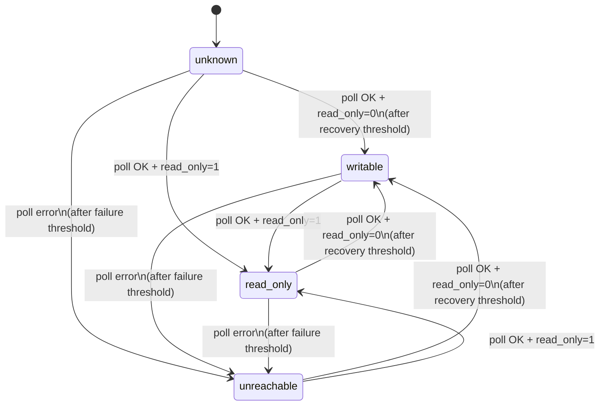
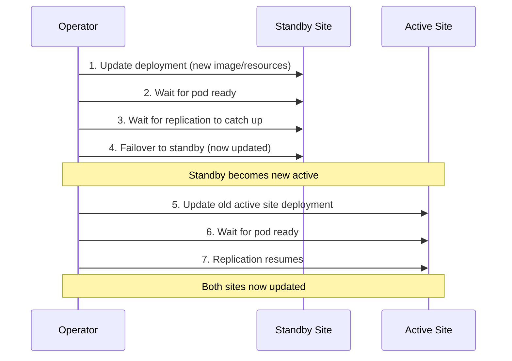

# Failover

This page covers the state machine that drives failover decisions, the exact sequence of operations during a failover, the anti-flap cooldown, and ordered updates for zero-downtime rollouts. For what happens when the operator itself is unavailable during a failure, see [Operator availability](./operator-availability.mdx).

## State machine

Each site in a failover group is tracked independently. The possible states are:

| State | Meaning |
|---|---|
| `unknown` | Initial state before the first successful poll |
| `writable` | MySQL is reachable and `read_only=0` |
| `read-only` | MySQL is reachable and `read_only=1` |
| `unreachable` | MySQL has failed the configured number of consecutive polls |

### State transitions

**Debouncing:**

- A site transitions to `unreachable` only after **failureThreshold** consecutive failed polls (default: 3). With a 2-second poll interval, this means 6 seconds of downtime before the operator considers the site unreachable.
- A site transitions to `writable` only after **recoveryThreshold** consecutive successful polls showing `read_only=0` (default: 2). This prevents premature promotion on transient successes.
- Transitions to `read-only` are immediate (single poll) since this is a safe, non-destructive state.

### Cross-site evaluation

After updating individual site states, the operator evaluates the pair together:

| Site A | Site B | Action |
|---|---|---|
| `writable` | `read-only` | **Healthy** -- no action needed |
| `unreachable` | `read-only` | **Failover** -- promote Site B |
| `read-only` | `unreachable` | **Failover** -- promote Site A |
| `writable` | `writable` | **Split brain** -- alert, no automatic action |
| `read-only` | `read-only` | **No primary** -- alert, no automatic action |
| `unreachable` | `unreachable` | **Total loss** -- alert, no automatic action |

The operator only takes automatic action for the failover case. All other anomalous states require human investigation.

## Failover sequence

When the operator decides to fail over to a candidate site, it executes these steps in order:

1. **Fence the old primary**: `SET GLOBAL super_read_only=ON`
   - If the old primary is unreachable, this step is skipped (it is already isolated)

2. **Drain relay logs on the candidate** (30-second timeout)
   - Waits for the candidate to finish applying any relay log events so that no committed transactions are lost

3. **Stop replication on the candidate**: `STOP REPLICA`

4. **Reset replication on the candidate**: `RESET REPLICA ALL`
   - Clears all replication configuration so the candidate operates as an independent primary

5. **Record promotion GTID**: `SELECT @@global.gtid_executed`
   - Captures the candidate's GTID set before it starts accepting writes, stored in `status.promotionGtidExecuted` for data-loss accounting

6. **Promote the candidate**: `SET GLOBAL read_only=0`
   - Makes the candidate writable

7. **Wait for confirmation**
   - The next poll cycle confirms the candidate is in the `writable` state

8. **Update DNSEndpoint**
   - Creates or updates the `DNSEndpoint` CR so that the A-record points to the candidate site's load balancer IP. external-dns syncs this to the configured DNS provider.

9. **Update node taints**
   - Taint old active site nodes: `shipstream.io/db-readonly-<group>=true:NoExecute`
   - Untaint new active site nodes: remove the `shipstream.io/db-readonly-<group>` taint

## Old primary recovery

After an emergency failover, the old primary may come back online. The operator automatically detects this and takes action based on whether the old primary's data has diverged from the new primary.

### Detection

On each poll cycle, if a site is read-only with no replication configured (the signature of a former primary after `RESET REPLICA ALL`), and a prior failover has occurred, the operator initiates recovery:

1. **Fence** the returning site with `SET GLOBAL super_read_only=ON` (defensive — the sidecar may have already fenced it)
2. **Query `@@global.gtid_executed`** on both the old and new primary
3. **Compare GTID sets** to determine if the old primary has any transactions not on the new primary

If the old primary returns **writable** (e.g., power was cut before the sidecar could self-fence), the operator first detects this as a split-brain condition and fences it immediately. Recovery proceeds on the next poll cycle once the site transitions to read-only.

### No divergence (automatic rejoin)

If the new primary's GTID set contains all transactions from the old primary, there is no data loss. The operator automatically reconfigures the old primary as a replica:

1. `SET GLOBAL super_read_only=ON`
2. `STOP REPLICA`
3. `CHANGE REPLICATION SOURCE TO ... SOURCE_AUTO_POSITION=1`
4. `START REPLICA`

The site resumes normal replication and the operator clears recovery state.

### Divergence detected (manual intervention required)

If the old primary has committed transactions that never replicated to the new primary, the operator:

- Keeps the site **fenced** (`super_read_only=ON`)
- Records the divergent GTID set and transaction count in `status.sites[].divergentGtid` and `status.sites[].divergentTransactionCount`
- Sets `status.sites[].recoveryState` to `RecoveryBlocked`
- Sets the `RecoveryPending` condition to `True` with reason `DivergentTransactions`
- Emits the `bloodraven_divergent_transactions` Prometheus metric

:::danger
Divergent transactions mean the old primary accepted writes that the new primary never received. These transactions are effectively lost from the replication stream. The site must be **re-cloned** from the current primary to recover. Do not attempt to manually reconfigure replication — conflicting GTID sets will cause replication errors.
:::

To recover a divergent site:

1. Investigate the divergent transactions to understand what data was lost (check `status.sites[].divergentGtid`)
2. Trigger a reclone using the annotation: `kubectl annotate mysqlfailovergroup <name> bloodraven.shipstream.io/reclone-site=<site>`
3. The operator will run `CLONE INSTANCE` on the target site, replacing all data with a fresh copy from the current primary

See [Recovering a divergent old primary](./operations.mdx#recovering-a-divergent-old-primary) for the full procedure.

### Prerequisites

Old primary recovery requires replication credentials (`MYSQL_REPLICATION_USER` and `MYSQL_REPLICATION_PASSWORD`) in the Secret referenced by `spec.secretName`. Without these, recovery is skipped and the site remains fenced.

## Anti-flap cooldown

To prevent rapid failover oscillation (e.g., a flapping network link), the operator enforces a cooldown period between automatic failovers. The default is 5 minutes, configurable via `spec.failoverCooldown`.

During the cooldown:

- The operator continues to monitor both sites and update status
- Automatic failovers are suppressed
- Manual intervention can still be performed (see [Operations](./operations.mdx))

The cooldown timer resets after each failover. The last failover time is recorded in `status.lastFailover`.

## Ordered updates

When `spec.updateStrategy` is set to `OrderedUpdate`, spec changes (such as a new `image` or resource adjustments) are rolled out with zero downtime:

This sequence ensures:

- The active primary is never restarted while serving traffic
- Replication is healthy before each transition
- At most one site is unavailable at any time

Without `OrderedUpdate`, both sites are updated simultaneously, which may cause brief downtime if both pods restart at the same time.
