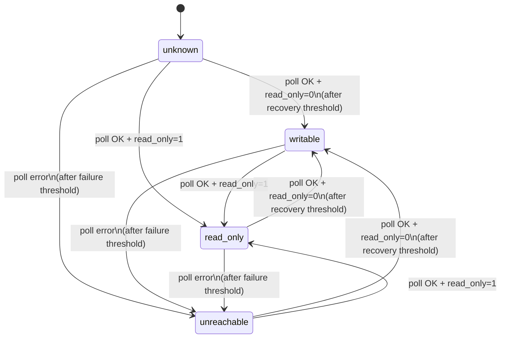
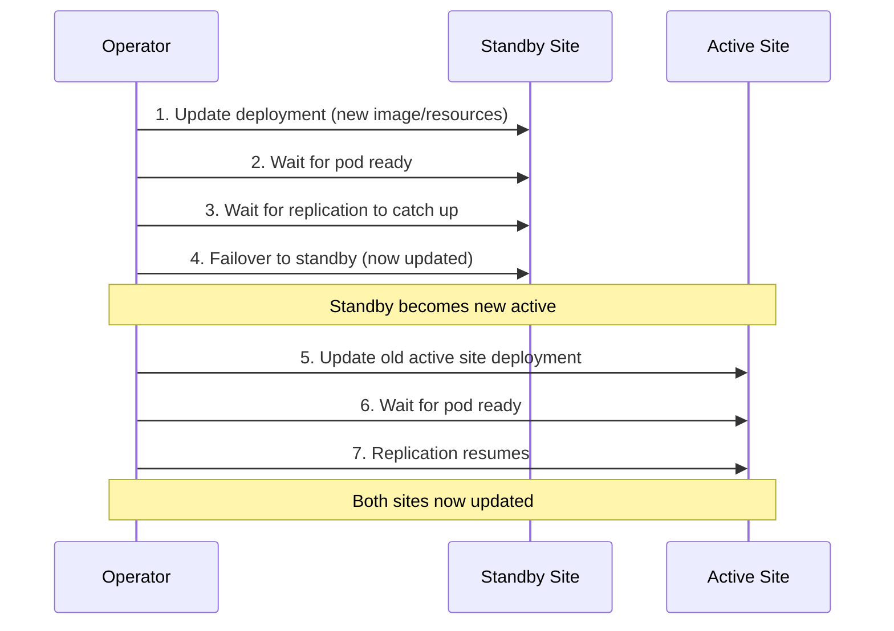

# Failover

This page covers the state machine that drives failover decisions, the exact sequence of operations during a failover, the anti-flap cooldown, and ordered updates for zero-downtime rollouts. For the bounded-RPO contract and the exact set of transactions that can be lost on emergency failover, see [Durability and RPO](./durability-and-rpo.mdx). For what happens when the operator itself is unavailable during a failure, see [Operator availability](./operator-availability.mdx).

## State machine

Each site in a failover group is tracked independently. The possible states are:

| State | Meaning |
|---|---|
| `unknown` | Initial state before the first successful poll |
| `writable` | MySQL is reachable and `read_only=0` |
| `read-only` | MySQL is reachable and `read_only=1` |
| `unreachable` | MySQL has failed the configured number of consecutive polls |

### State transitions



**Debouncing:**

- A site transitions to `unreachable` only after **failureThreshold** consecutive failed polls (default: 3). With a 2-second poll interval, this means 6 seconds of downtime before the operator considers the site unreachable.
- A site transitions to `writable` only after **recoveryThreshold** consecutive successful polls showing `read_only=0` (default: 2). This prevents premature promotion on transient successes.
- Transitions to `read-only` are immediate (single poll) since this is a safe, non-destructive state.

### Cross-site evaluation

After updating individual site states, the operator evaluates the pair together:

| Site A | Site B | Action |
|---|---|---|
| `writable` | `read-only` | **Healthy** -- no action needed |
| `unreachable` | `read-only` | **Failover** -- promote Site B |
| `read-only` | `unreachable` | **Failover** -- promote Site A |
| `writable` | `writable` | **Split brain** -- see [Split-brain resolution](#split-brain-resolution) |
| `read-only` | `read-only` | **No primary** -- alert, no automatic action |
| `unreachable` | `unreachable` | **Total loss** -- alert, no automatic action |

The operator only takes automatic action for the failover case (and, opt-in, for split brain). All other anomalous states require human investigation.

## Failover sequence

When the operator decides to fail over to a candidate site, it executes these steps in order:

1. **Fence the old primary**: `SET GLOBAL super_read_only=ON`
   - If the old primary is unreachable, this step is skipped (it is already isolated)

2. **Drain relay logs on the candidate** (30-second timeout)
   - Waits for the candidate to finish applying any relay log events so that no committed transactions are lost

3. **Stop replication on the candidate**: `STOP REPLICA`

4. **Reset replication on the candidate**: `RESET REPLICA ALL`
   - Clears all replication configuration so the candidate operates as an independent primary

5. **Record promotion GTID**: `SELECT @@global.gtid_executed`
   - Captures the candidate's GTID set before it starts accepting writes, stored in `status.promotionGtidExecuted` for data-loss accounting

6. **Promote the candidate**: `SET GLOBAL read_only=0`
   - Makes the candidate writable

7. **Wait for confirmation**
   - The next poll cycle confirms the candidate is in the `writable` state

8. **Update DNSEndpoint**
   - Creates or updates the `DNSEndpoint` CR so that the A-record points to the candidate site's load balancer IP. external-dns syncs this to the configured DNS provider.

9. **Update node taints**
   - Taint old active site nodes: `shipstream.io/db-readonly-<group>=true:NoExecute`
   - Untaint new active site nodes: remove the `shipstream.io/db-readonly-<group>` taint

## Old primary recovery

After an emergency failover, the old primary may come back online. The operator automatically detects this and takes action based on whether the old primary's data has diverged from the new primary.

### Detection

On each poll cycle, if a site is read-only with no replication configured (the signature of a former primary after `RESET REPLICA ALL`), and a prior failover has occurred, the operator initiates recovery:

1. **Fence** the returning site with `SET GLOBAL super_read_only=ON` (defensive — the sidecar may have already fenced it)
2. **Query `@@global.gtid_executed`** on both the old and new primary
3. **Compare GTID sets** to determine if the old primary has any transactions not on the new primary

If the old primary returns **writable** (e.g., power was cut before the sidecar could self-fence), the operator first detects this as a split-brain condition and fences it immediately. Recovery proceeds on the next poll cycle once the site transitions to read-only.

### No divergence (automatic rejoin)

If the new primary's GTID set contains all transactions from the old primary, there is no data loss. The operator automatically reconfigures the old primary as a replica:

1. `SET GLOBAL super_read_only=ON`
2. `STOP REPLICA`
3. `CHANGE REPLICATION SOURCE TO ... SOURCE_AUTO_POSITION=1`
4. `START REPLICA`

The site resumes normal replication and the operator clears recovery state.

### Divergence detected (manual intervention required)

If the old primary has committed transactions that never replicated to the new primary, the operator:

- Keeps the site **fenced** (`super_read_only=ON`)
- Records the divergent GTID set and transaction count in `status.sites[].divergentGtid` and `status.sites[].divergentTransactionCount`
- Sets `status.sites[].recoveryState` to `RecoveryBlocked`
- Sets the `RecoveryPending` condition to `True` with reason `DivergentTransactions`
- Emits the `bloodraven_divergent_transactions` Prometheus metric

:::danger
Divergent transactions mean the old primary accepted writes that the new primary never received. These transactions are effectively lost from the replication stream. The site must be **re-cloned** from the current primary to recover. Do not attempt to manually reconfigure replication — conflicting GTID sets will cause replication errors.
:::

To recover a divergent site:

1. Investigate the divergent transactions to understand what data was lost (check `status.sites[].divergentGtid`)
2. Trigger a reclone using the annotation, including the first 8+ characters of the observed `divergentGtid` as a confirmation token:

   ```bash
   # Read the divergent GTID first:
   kubectl get mysqlfailovergroup <name> -o jsonpath='{.status.sites[?(@.name=="<site>")].divergentGtid}'
   # Then annotate with <site>:<prefix-of-divergentGtid>:
   kubectl annotate mysqlfailovergroup <name> bloodraven.shipstream.io/reclone-site=<site>:<gtid-prefix>
   ```

3. The operator validates that the prefix matches the observed `divergentGtid` — a mismatch is rejected with a `RecloneRejected` Warning Event, so a fat-fingered site name can't destroy the wrong replica. When a site has **no** `divergentGtid` (cold reclone: PVC loss, manual rebuild), the bare form `reclone-site=<site>` is still accepted.
4. The operator runs `CLONE INSTANCE` on the target site, replacing all data with a fresh copy from the current primary. A `RecloneRequested` Event marks the start.

See [Recovering a divergent old primary](./operations.mdx#recovering-a-divergent-old-primary) for the full procedure.

### Prerequisites

Old primary recovery requires replication credentials (`MYSQL_REPLICATION_USER` and `MYSQL_REPLICATION_PASSWORD`) in the Secret referenced by `spec.secretName`. Without these, recovery is skipped and the site remains fenced.

## Split-brain resolution

When the state machine observes both sites as `writable` simultaneously, the operator's response is tiered:

1. **After a prior operator-initiated failover** -- The operator already knows which site it promoted (`status.lastFailoverTarget`). The other site being writable means the old primary returned. The operator fences it immediately (`SET GLOBAL super_read_only=ON`) and recovery proceeds on the next poll. This runs regardless of `spec.splitBrainPolicy`.
2. **No prior failover history, `spec.splitBrainPolicy.preferSite` is set** -- The operator fences the non-preferred site and re-promotes the preferred one through the standard failover path (DNS flip, relay-log drain, `RESET REPLICA ALL`, promotion GTID record, `read_only=0`). The anti-flap cooldown still applies to this promotion.
3. **No prior failover history, no `preferSite` configured** -- The operator alerts only (`SPLIT BRAIN: both sites are writable`) and takes no automated action. This is the default.

### When `preferSite` applies

`preferSite` is a tiebreaker for states the operator cannot resolve from its own history. The two common triggers:

- **Fresh deploy with existing data.** Both sites come up writable and `lastFailoverTarget` is empty because this operator instance has never failed anything over. Without `preferSite`, the operator alerts and waits for an admin.
- **Operator restart amnesia.** In-memory `lastFailoverTarget` is repopulated from `status.lastFailoverTarget` at startup, but if a split brain occurred during the restart window (for example, an old primary came back *while* the operator was restarting), the operator may never have had an opportunity to record the most recent failover. `preferSite` provides a deterministic answer in this case.

When history *is* available (case 1 above), the operator trusts it and does **not** consult `preferSite`. This preserves the invariant that the site most recently promoted keeps its writes.

### Configuration

```yaml
apiVersion: shipstream.io/v1alpha1
kind: MysqlFailoverGroup
metadata:
  name: orders
spec:
  sites:
    - name: iad
      # ...
    - name: pdx
      # ...
  splitBrainPolicy:
    preferSite: iad  # "iad always wins ties"
```

`preferSite` must match one of `spec.sites[].name`; the CRD's CEL validation rejects mismatches at admission time.

### Data-loss implications

:::danger
`preferSite` is a **policy** decision, not a safety feature. When the operator fences the losing site to resolve a split brain:

- Any transactions committed on the losing site that did *not* replicate to the winner are isolated.
- Those transactions are *not* automatically replayed, merged, or preserved. They remain on the losing site's PVC but are outside the replication stream.
- When the fenced site attempts to rejoin, Bloodraven's existing divergent-GTID detection compares `executed_gtid_set` on both sides. If the loser has GTIDs the winner never saw, rejoin is **blocked** and the site must be recloned to recover. The divergent GTID set and transaction count are recorded in `status.sites[].divergentGtid` and `status.sites[].divergentTransactionCount`.
- In other words, `preferSite` makes split-brain resolution fast and deterministic at the cost of silently losing the loser's unreplicated writes. The loss is surfaced loudly (`RecoveryBlocked` condition, `bloodraven_divergent_transactions` gauge) but not prevented.
:::

Choose `preferSite` only when your operational model has a clear authoritative site -- for example, a primary region that you always want writes to land in, with the other region serving as a pure DR replica whose occasional writes during a split brain are acceptable to discard.

### Observability

- Metric: `bloodraven_split_brain_auto_resolve_total{prefer_site="<name>"}` -- counter, incremented each time the operator resolves a split brain by fencing the non-preferred site.
- Log event: `split-brain auto-resolve: fencing non-preferred site per spec.splitBrainPolicy.preferSite` at `warn` level, with `preferSite` and `fencedSite` fields.
- The standard failover log, metric (`bloodraven_failovers_total`), and DNS-flip metric (`bloodraven_dns_flips_total`) also fire, since split-brain resolution runs through the same promotion path.

## Anti-flap cooldown

To prevent rapid failover oscillation (e.g., a flapping network link), the operator enforces a cooldown period between automatic failovers. The default is 5 minutes, configurable via `spec.failoverCooldown`.

During the cooldown:

- The operator continues to monitor both sites and update status
- Automatic failovers are suppressed
- Manual intervention can still be performed (see [Operations](./operations.mdx))

The cooldown timer resets after each failover. The last failover time is recorded in `status.lastFailover`.

## Ordered updates

When `spec.updateStrategy` is set to `OrderedUpdate`, spec changes (such as a new `image` or resource adjustments) are rolled out with zero downtime:



This sequence ensures:

- The active primary is never restarted while serving traffic
- Replication is healthy before each transition
- At most one site is unavailable at any time

Without `OrderedUpdate`, both sites are updated simultaneously, which may cause brief downtime if both pods restart at the same time.

For MySQL image changes specifically — including the upcoming 9.6 → 9.7 LTS transition — see the [Upgrade and version-skew policy](./upgrade-policy.mdx). The replica-first ordering above is the MySQL-required direction for a rolling version upgrade.
