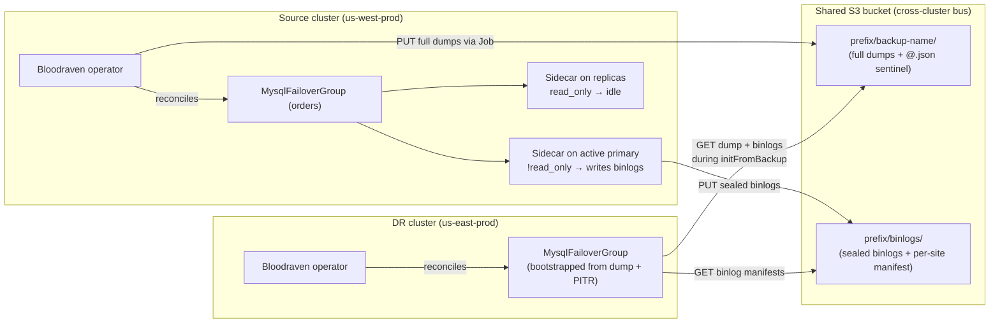

# Multi-cluster disaster recovery

This page is the operational runbook for recovering a `MysqlFailoverGroup`
into a separate Kubernetes cluster when the source cluster is lost. It
covers every step from topology to DNS cutover using **only the existing
`MysqlFailoverGroup` CRD surface** (available today on `main`). No new
CRDs or controllers are required to execute this runbook.

WISHLIST #7 introduces `MysqlStandbyCluster` as a **passive observability
layer** that surfaces source-archive freshness via `BucketReadable` /
`SourceConfigKnown` conditions. Phase 2 adds a readiness gate
(`Restorable`); Phase 3 adds one-command activation. See
[What MysqlStandbyCluster adds](#what-mysqlstandbycluster-phase-1-adds-today)
at the bottom of this page for details on what ships in that first phase
and what remains in later phases.

---

## Topology overview

Cross-cluster DR in Bloodraven v1 uses the shared object store (S3 or
compatible) as the **only** channel between the source and DR clusters.
There is no cross-cluster replication link, no operator-to-operator RPC,
and no federation.



Key points:

- The **source cluster writes**: full dumps (operator-driven backup Jobs)
  and sealed binlogs (sidecar archiver on the active primary, gated on
  `!@@read_only`). The upload switches to a new primary within one
  archiver scan cycle after an intra-cluster failover.
- The **DR cluster only reads** during bootstrap. It does not run a
  binlog archiver of its own — there is nothing to archive from a
  cluster that does not yet exist.
- `dr-only` site roles (`api/v1alpha1/types.go:280-283`,
  [Multi-site topology](./multi-site.mdx)) are a separate concept: they
  are passive replicas inside the **same** cluster as the source MFG and
  are never auto-promoted. Cross-cluster DR is distinct from this.

---

## Bucket and IAM layout

### Bucket structure

Bloodraven writes to the bucket prefix configured in
`spec.backup.profiles[].storage.s3.prefix`. The layout under that prefix:

```
<prefix>/
  <mysqlbackup-name>/          # one directory per successful full dump
    @.json                     # dump sentinel: GTIDs, size, completion time
    <shard-files>.sql.gz       # mysqlsh dumpInstance artifacts
  binlogs/                     # PITR archive (when spec.backup.pitr.enabled=true)
    manifest-<site>.json       # per-site sealed-binlog manifest
    <site>/
      <binlog-file>.enc        # sealed binlogs (possibly encrypted)
  dr-cursors/                  # Phase 2: reserved, not written in this release
```

The DR cluster only needs read access to `<prefix>/` to execute this
runbook. Write access to `dr-cursors/` is reserved for the
`MysqlStandbyCluster` passive-discovery feature (Phase 2 of WISHLIST #7).

### Minimum IAM policy — AWS

Grant the DR cluster's service account or IAM role the following policy.
Replace `shipstream-backups` and `orders/west` with your actual bucket
name and prefix.

**DR cluster read-only policy:**

```json
{
  "Version": "2012-10-17",
  "Statement": [
    {
      "Sid": "DRReadOnly",
      "Effect": "Allow",
      "Action": ["s3:ListBucket", "s3:GetObject"],
      "Resource": [
        "arn:aws:s3:::shipstream-backups",
        "arn:aws:s3:::shipstream-backups/orders/west/*"
      ]
    }
  ]
}
```

Scope the `ListBucket` resource to the bucket name (not a prefix — S3
requires bucket-level `ListBucket`), and the `GetObject` resource to the
prefix subtree. The DR restore Job uses the `credentialsSecret` you
reference in `spec.initFromBackup.source.s3`; that Secret must contain
AWS credentials (or the pod must have IRSA/Workload Identity access) that
the above policy covers.

:::note Phase 2 cursor writes
When `MysqlStandbyCluster` ships (Phase 2), the DR side needs one
additional write permission scoped to `dr-cursors/*` only. Do not add
it until that phase is in use.
:::

### GCS / S3-compatible (MinIO, Ceph)

Bloodraven uses the AWS SDK v2 with a configurable `endpoint`. Set
`spec.initFromBackup.source.s3.endpointURL` (or
`spec.backup.profiles[].storage.s3.endpointURL` on the source) to your
endpoint. Minimum equivalent permissions:

| Cloud | Equivalent permissions |
|---|---|
| GCS (interop) | `storage.objects.list` + `storage.objects.get` on the prefix |
| MinIO | `s3:ListBucket` + `s3:GetObject` — same policy syntax |
| Ceph RGW | Same as MinIO; set `endpointURL` to your RGW endpoint |

---

## Encryption passphrase distribution

When the source profile uses `spec.backup.profiles[].encryption`, every
dump artifact and archived binlog is wrapped in the Bloodraven BRV1
format (AES-256-GCM envelope). The DR restore Job must have the same
passphrase available.

The operator does not distribute passphrases across clusters. Follow
these steps before triggering a recovery:

**Step 1.** Read the passphrase from the source cluster:

```bash
kubectl -n orders get secret orders-backup-passphrase \
  -o jsonpath='{.data.passphrase}' | base64 -d
```

**Step 2.** Create the same Secret in the DR cluster's namespace:

```bash
kubectl -n orders create secret generic orders-backup-passphrase \
  --from-literal=passphrase='<value from step 1>'
```

**Step 3.** Reference it in the DR restore manifest via
`spec.initFromBackup.decryption.passphraseSecret.name`. See
[Backup encryption](./backup-encryption.mdx) for full field semantics.

If the passphrase Secret is missing or wrong, the restore Job fails fast
with:

```
Warning  RestoreBuildFailed
  initFromBackup source is encrypted but no passphrase is available;
  set initFromBackup.decryption.passphraseSecret or restore the
  profile's encryption.passphraseSecret
```

This is a clean, recoverable error — fix the Secret and delete the
failed Job; the reconciler rebuilds it.

---

## Source fencing checklist

Before you trigger a recovery into the DR cluster, confirm the source is
genuinely down. Promoting the DR copy while the source is still accepting
writes produces two writable clusters. Bloodraven v1 does not
automatically detect or resolve cross-cluster split-brain — divergent
GTIDs accumulate on the source side and can only be audited post-hoc (see
[Durability and RPO](./durability-and-rpo.mdx#the-exact-bound-divergentgtid)).

Use at least two of these three signals before proceeding:

**Signal 1 — Source operator `/active-site` endpoint returns 5xx:**

```bash
curl -f 'http://<source-operator-aux-svc>:8082/active-site?namespace=orders&group=orders'
# Healthy: {"activeSite":"iad"}
# Down:    curl: (22) The requested URL returned error: 503
```

The operator's auxiliary HTTP server (`cmd/bloodraven/main.go:361`) serves
`/active-site` on port `8082` and requires `namespace` plus `group` query
parameters. It returns 503 when it cannot reach any writable site.

**Signal 2 — Source cluster API server is unreachable:**

```bash
kubectl --context=<source-context> get nodes --request-timeout=10s
# Error from server: timeout waiting for server response
```

**Signal 3 — Source MySQL endpoint is TCP-unreachable from a third
vantage point:**

```bash
# From a network location that is NOT one of the two clusters
nc -zv <source-mysql-lb-ip> 3306
# Connection refused / timeout
```

If any signal is ambiguous — for example, the API server is reachable but
appears degraded — wait for a clearer signal rather than promoting. The
cost of delaying a few minutes is far lower than the cost of a
split-brain incident.

:::warning Split-brain risk
Bloodraven v1 does not fence the source before or after you promote the
DR cluster. Issuing `initFromBackup` on the DR cluster when the source is
still alive produces two writable groups. Use the three signals above to
be certain before proceeding.
:::

---

## Recovery procedure

This walkthrough assumes:

- The source `MysqlFailoverGroup` is named `orders`, in namespace
  `orders`, and had PITR enabled under a profile named `nightly-s3`
  stored at `s3://shipstream-backups/orders/west`.
- The DR cluster has network access to the same S3 bucket.
- The passphrase Secret has been mirrored (see above).
- The DR cluster has a fresh namespace `orders` with Bloodraven
  installed (same operator version as the source; see
  [Install production](./install-production.mdx)).

### Step 1 — Identify the recovery point

Locate the most recent successful dump in the source bucket:

```bash
aws s3 ls s3://shipstream-backups/orders/west/ --recursive \
  | grep '@\.json' | sort -k1,2 | tail -5
```

Each directory under `orders/west/` that contains `@.json` is a
completed dump. The `@.json` holds the completion timestamp, GTID set,
and dump size. Pick the most recent `@.json` whose directory you want to
recover from. Note its prefix — for example,
`orders/west/orders-nightly-20260520`.

To target a specific point in time (e.g., 14:32 UTC before a bad
migration), note the desired `stopDatetime`. Binlogs replayed after the
dump will be bounded by the newest sealed binlog archived before the
event; the unarchived tail on the lost primary's PVC is not recoverable
(see [PITR and the RPO window](./durability-and-rpo.mdx#pitr-and-the-rpo-window)).

### Step 2 — Apply the DR `MysqlFailoverGroup`

Create a `MysqlFailoverGroup` on the DR cluster configured for the DR
environment's nodes, IPs, and DNS. Set `spec.initFromBackup` to pull from
the source bucket.

**Source group configuration (reference — source cluster):**

```yaml
apiVersion: shipstream.io/v1alpha1
kind: MysqlFailoverGroup
metadata:
  name: orders
  namespace: orders
spec:
  sites:
    - name: iad
      role: primary-candidate
      zone: us-east-1a
      taintNodeSelector:
        shipstream.io/failover-group.orders: "true"
        shipstream.io/site.orders: iad
      lbIP: 10.0.10.11
      storage: { storageClassName: gp3, size: 500Gi }
    - name: iad-2
      role: primary-candidate
      zone: us-east-1b
      taintNodeSelector:
        shipstream.io/failover-group.orders: "true"
        shipstream.io/site.orders: iad-2
      lbIP: 10.0.10.12
      storage: { storageClassName: gp3, size: 500Gi }
  secretName: mysql-operator-creds
  dns:
    hostname: orders-east.example.com
    ttl: 60
  backup:
    profiles:
      - name: nightly-s3
        storage:
          type: S3
          s3:
            bucket: shipstream-backups
            prefix: orders/west
            region: us-west-2
            credentialsSecret: s3-backup-creds
        encryption:
          passphraseSecret:
            name: orders-backup-passphrase
    pitr:
      enabled: true
      profileName: nightly-s3
```

**DR cluster recovery manifest:**

```yaml
apiVersion: shipstream.io/v1alpha1
kind: MysqlFailoverGroup
metadata:
  name: orders
  namespace: orders
spec:
  # DR-local node topology — different nodes, IPs, and zones from source
  sites:
    - name: east-1
      role: primary-candidate
      zone: us-east-1a
      taintNodeSelector:
        shipstream.io/failover-group.orders: "true"
        shipstream.io/site.orders: east-1
      lbIP: 10.1.20.11           # DR cluster's LB IP
      storage: { storageClassName: gp3, size: 500Gi }
    - name: east-2
      role: primary-candidate
      zone: us-east-1b
      taintNodeSelector:
        shipstream.io/failover-group.orders: "true"
        shipstream.io/site.orders: east-2
      lbIP: 10.1.20.12
      storage: { storageClassName: gp3, size: 500Gi }
  secretName: mysql-operator-creds   # must exist in DR namespace
  dns:
    hostname: orders-east.example.com
    ttl: 60
  initFromBackup:
    source:
      s3:
        bucket: shipstream-backups
        prefix: orders/west/orders-nightly-20260520  # exact dump directory
        region: us-west-2
        credentialsSecret: s3-dr-readonly-creds      # DR read-only creds
    decryption:
      passphraseSecret:
        name: orders-backup-passphrase               # mirrored from source
    pointInTime:                                     # omit if recovering to dump GTID
      stopDatetime: "2026-05-20T14:32:00Z"
```

Apply to the DR cluster:

```bash
kubectl --context=<dr-context> apply -f dr-orders.yaml
```

### Step 3 — Monitor the restore

```bash
kubectl --context=<dr-context> -n orders get mysqlfailovergroup orders -w
```

Watch `status.restore.phase`. The sequence:

| Phase | Meaning |
|---|---|
| `Pending` | Restore Job not yet created |
| `Running` | `util.loadDump()` is running (and optionally `mysqlbinlog` replay after) |
| `Succeeded` | Dump and any PITR replay completed; bootstrap continues |
| `Failed` | Inspect `status.restore.message` and Job logs |

Full status:

```bash
kubectl --context=<dr-context> -n orders describe mysqlfailovergroup orders
```

The `initFromBackup` path is one-shot and runs before the failover group
is considered ready (`api/v1alpha1/backup_types.go:552-557`). Once
`status.restore.phase == Succeeded`, bootstrap (clone, replication,
fencing) completes normally.

### Step 4 — Verify the DR group is healthy

```bash
kubectl --context=<dr-context> -n orders get mysqlfailovergroup orders -o yaml \
  | grep -A5 'conditions:'
```

Wait for `Ready=True`. Check that at least one site is `writable` and
replication is up on the peer:

```bash
kubectl --context=<dr-context> -n orders get mysqlfailovergroup orders \
  -o jsonpath='{.status.activeSite}'
```

### Step 5 — DNS cutover

Bloodraven writes a `DNSEndpoint` CR per site using
`external-dns/endpoint-controller.io/v1` (`api/v1alpha1/types.go:371-384`,
`internal/platform/dns.go:23-31`). The operator controls the
**per-cluster** DNS record for `spec.dns.hostname` in whatever cluster it
runs in. It does **not** control the global application-facing record.

Choose one of these cutover patterns:

**Option A — Weighted CNAME with health checks (recommended for
production)**

Maintain a weighted CNAME (Route53, Google Cloud DNS, Akamai GTM) or a
GSLB record that points at both clusters. On source loss:

1. Set source weight to 0 (or let health checks drop it automatically if
   the source LB IP is unreachable).
2. Set DR weight to 100.
3. TTL propagation time depends on your DNS TTL. Pre-reducing TTL to
   ≤ 60 s before an expected maintenance window shortens this.

**Option B — Manual flip (simplest)**

```bash
# Point the application CNAME at the DR cluster's DNS name
aws route53 change-resource-record-sets --hosted-zone-id Z123 --change-batch '{
  "Changes": [{
    "Action": "UPSERT",
    "ResourceRecordSet": {
      "Name": "db.example.com",
      "Type": "CNAME",
      "TTL": 60,
      "ResourceRecords": [{"Value": "orders-east.example.com"}]
    }
  }]
}'
```

**Option C — GSLB / Akamai GTM**

Mark the source origin as offline in the GTM policy. The GSLB health
monitor will have already removed it from rotation if the TCP probe to
MySQL is failing.

After DNS propagation, confirm applications are connecting to the DR
cluster (check `status.activeSite` and replication lag on the DR group).

---

## Failback narrative

When the source cluster returns, the original path is reversible. This is
a manual, prose-only procedure in v1; Phase 4 of WISHLIST #7 will
document and partially automate it.

The high-level steps:

1. **Confirm the DR cluster is steady-state primary.** New writes are
   landing on the DR cluster; intra-cluster replication (if multi-site)
   is healthy.

2. **Wipe the source cluster's MySQL state.** Delete the old
   `MysqlFailoverGroup` CR. The operator cascades to Deployments,
   Services, and DNSEndpoints; PVCs are **not** cascaded — delete them
   explicitly:

   ```bash
   kubectl --context=<source-context> -n orders delete mysqlfailovergroup orders
   kubectl --context=<source-context> -n orders delete pvc \
     -l bloodraven.shipstream.io/failover-group=orders
   ```

3. **Ensure the DR group's backup prefix does not collide with the
   original source prefix.** A directional prefix convention avoids
   ambiguity — for example, use `orders/east/` for the DR group's dumps
   and `orders/west/` for the original source. Update the DR group's
   `spec.backup.profiles[].storage.s3.prefix` accordingly before the DR
   group takes its first backup.

4. **Stand up a fresh `MysqlFailoverGroup` on the source cluster** with
   `spec.initFromBackup` pointing at the DR cluster's new prefix (the
   backup that the now-primary DR cluster took). This is the same pattern
   as the original recovery, but in reverse. Wait for
   `status.restore.phase=Succeeded`.

5. **Cut DNS back if desired.** This step is optional and human-driven.
   Bloodraven v1 does not auto-rebalance traffic across clusters.

Phase 4 (WISHLIST #7) introduces `MysqlStandbyCluster` symmetric failback:
a second standby CR on the returning source cluster pointing at the DR
cluster's new prefix, with the same continuous verification and
one-command activation path that Phase 3 provides for the forward
direction.

---

## What `MysqlStandbyCluster` (Phase 1) adds today

WISHLIST #7 Phase 1 introduces `MysqlStandbyCluster` — a new CRD that
lives on the DR cluster and continuously monitors the source bucket.

**What Phase 1 ships:**

- A new `MysqlStandbyCluster` CR (`shipstream.io/v1alpha1`, short name
  `msc`) that names the relationship between a source MFG's backup
  archive and this DR cluster.
- A passive reconciler (`MysqlStandbyClusterReconciler`) that runs a
  discovery loop on a configurable cadence (default 5 minutes):
  - Lists objects under the configured S3 prefix to find the most recent
    successful full dump and per-site binlog manifests.
  - Populates `status.discovered` with the dump location, completion
    time, GTID set, and binlog window timestamps.
  - Stamps `BucketReadable=True/False` based on whether the bucket scan
    succeeded.
  - Stamps `SourceConfigKnown=True/False` based on whether at least one
    dump and one binlog manifest were found.
- No mysqld is started, no dump is loaded, and no `MysqlFailoverGroup` is
  materialized. Phase 1 is purely observational.

**What Phase 1 does NOT ship:**

- Continuous restore verification (`Restorable` condition) — Phase 2.
- One-command activation (`dr-activate` kubectl plugin, `spec.activate`
  state machine) — Phase 3.
- Failback tooling — Phase 4.

An on-call engineer recovering from a cluster loss still executes this
runbook manually. Phase 1's value is operational visibility: you can see
at a glance whether the source bucket is readable and whether a dump +
binlog window exist, without having to run `aws s3 ls` yourself.

**Sample `MysqlStandbyCluster` CR:**

```yaml
apiVersion: shipstream.io/v1alpha1
kind: MysqlStandbyCluster
metadata:
  name: orders-east-from-west
  namespace: orders
spec:
  transport: ObjectStore
  source:
    failoverGroupName: orders
    cluster: us-west-prod          # informational
    namespace: orders
    profileName: nightly-s3
    storage:
      type: S3
      s3:
        bucket: shipstream-backups
        prefix: orders/west
        region: us-west-2
        credentialsSecret: s3-dr-readonly-creds
    decryption:
      passphraseSecret:
        name: orders-backup-passphrase
  template:
    name: orders-east-dr
    spec:
      image: mysql:9.6
      secretName: orders-mysql-creds
  # freshness/activate fields exist in the CRD but are consumed by later
  # phases. Phase 1 reads source.storage and source.decryption to drive the
  # discovery loop.
```

Check status:

```bash
kubectl -n orders get mysqlstandbycluster orders-east-from-west -o yaml
```

Look for `status.discovered.dumpLocation`, `status.discovered.dumpCompletionTime`,
and the `BucketReadable` and `SourceConfigKnown` conditions.

**Planned follow-up phases (tracking issue: WISHLIST #7):**

- **Phase 2** — Continuous DR readiness: the reconciler schedules
  periodic `MysqlBackupVerification` runs against the discovered dump +
  binlog window, publishing a `Restorable` condition and a
  `bloodraven_dr_restorable_timestamp_seconds` gauge. The source
  operator gains awareness of `dr-cursors/` sentinel objects to prevent
  premature binlog pruning. Prerequisite: WISHLIST #43 (PITR E2E
  scenarios).
- **Phase 3** — One-command activation: `kubectl bloodraven dr-activate`
  + the `spec.activate.confirm` confirm-token gate materializes a
  writable `MysqlFailoverGroup` from the discovered dump. The activation
  state machine is phase-stamped and durable across operator restarts.
- **Phase 4** — Failback tooling: symmetric `MysqlStandbyCluster` on the
  returning source cluster + extended runbook.

Until Phase 3 ships, activation always requires the manual
`spec.initFromBackup` steps described in this runbook.
