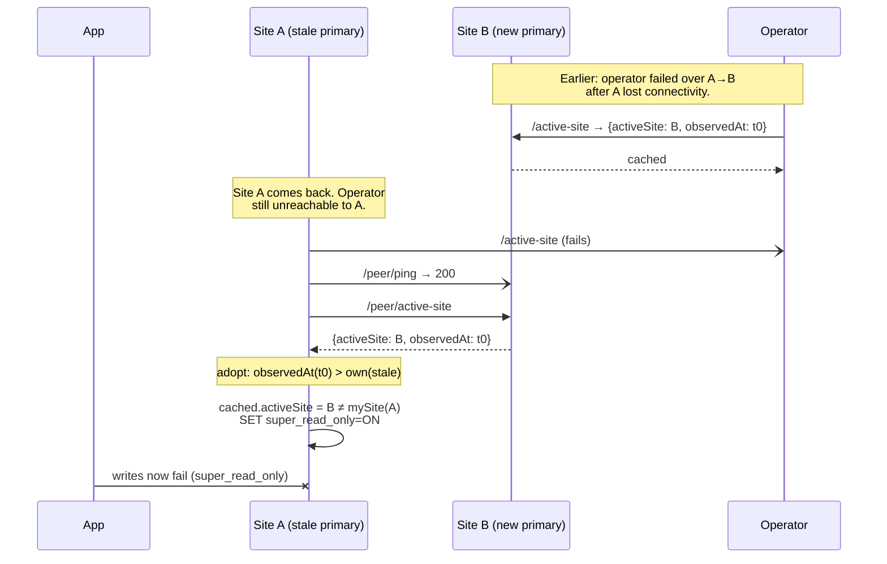

# Operator availability

Bloodraven is deliberately **not** a highly-available control plane. It runs
as a single-replica Deployment with controller-runtime leader election
enabled as a safety belt, and this page documents exactly what that means
for the data plane — especially for the uncomfortable case of a primary
failure that happens *while the operator is also down*.

## Design stance

- **One active operator at a time.** Leader election is on by default
  (`charts/bloodraven/values.yaml`), but scaling `replicaCount` above 1
  does not buy a faster failover. Whichever replica holds the lease is
  the sole writer of status, DNS, and promotion commands; every other
  replica is idle and just waiting to take over.
- **The MySQL data plane does not need the operator to serve traffic.**
  A healthy primary and replica keep serving reads and writes with zero
  operator involvement. The operator is on the failure-detection and
  promotion path, not the request path.
- **Correctness is preserved during operator downtime.** The
  [sidecar self-fencing](./architecture.mdx#sidecar-bloodraven-sidecar)
  layer stops any MySQL instance from accepting writes when it can reach
  neither the operator nor its peer for `spec.sidecar.leaseTimeout`
  (default `20s`). See [Operator-down + primary failure](#operator-down--primary-failure)
  below.
- **Availability is not preserved during operator downtime.** A primary
  failure while the operator is down is an outage for writes until the
  operator comes back. This is the explicit tradeoff. If you need
  lower MTTR, invest in faster operator recovery (small image / fast
  image pulls, short liveness probe backoff, favorable scheduling or
  `priorityClass`) rather than in a multi-replica control plane.

## What the operator is responsible for

For context, here is every action that *only* the operator performs.
Nothing in this list happens during operator downtime.

- Polling each site's MySQL instance and debouncing `writable` /
  `read-only` / `unreachable` transitions (see [state machine](./failover.mdx#state-machine)).
- Deciding whether a cross-site combination warrants a failover, an
  alert, or no action.
- Running the [failover sequence](./failover.mdx#failover-sequence):
  promote the replica, flip the `-primary` Service selector, update the
  `DNSEndpoint` record, taint the losing site's nodes.
- Reconciling Pods, PVCs, Services, and the two MySQL Deployments from
  the `MysqlFailoverGroup` spec.
- Reconciling backup `CronJob`s, creating `MysqlBackup` Jobs, and
  running retention cleanup.
- Writing `status.*` fields on the CR (active site, conditions, PITR
  coverage, divergent GTIDs, etc.).
- Answering the sidecars' `GET /active-site` probe, which is what the
  sidecar uses to decide whether to self-fence on boot.

## What happens when the operator is down

### Healthy steady state

Nothing visible to applications. MySQL keeps serving reads and writes on
whatever site is active. Replication keeps flowing. Sidecar health probes
keep succeeding. The only observable signal is that the operator pod is
down (liveness probe / Prometheus `up{job="bloodraven"}`), and
`status.*` fields on `MysqlFailoverGroup` objects stop updating.

### Rolling restart / image upgrade

A normal pod restart is ≈ 5–10 seconds. Within that window:

- No MySQL state changes are observed.
- Sidecars count down `leaseTimeout` (default `20s`). The restart
  finishes well before that, and on the next periodic fencing check
  (`peerCheckInterval`, default `5s`) the sidecar can reach the
  operator's `/healthz` endpoint again, so the self-fence timer is
  refreshed before it expires.
- In-flight `RecloneRequested` / `RecloneRejected` decisions are
  idempotent: the annotation is either still present (will be handled
  on the next sync) or already cleared.

No special procedure is required for operator image upgrades.

### Operator-down + primary failure

This is the case the wishlist asked us to document explicitly.

**Timeline.** Assume the operator has been down for longer than
`leaseTimeout` (20 s) when the active primary crashes or is partitioned.

| T | Event | Observable state |
|---|---|---|
| 0 | Operator pod crashes / is being upgraded. Liveness fails. | `-primary` Service still points at the active primary; replica is healthy. |
| ≤ 20 s | Sidecars on both sites notice the operator is unreachable. Each one starts its `leaseTimeout` timer. | Nothing user-visible. Writes still work. |
| tp | The primary pod goes down for any reason (node crash, OOM, partition, manual kill). | Apps connecting to `-primary` fail: first `ECONNREFUSED` once the pod is gone, then DNS name resolves but the Service has no endpoints. Reads from `-replicas` continue uninterrupted. |
| tp + 20 s | If the primary pod is still alive but isolated (network partition), its own sidecar observes that both the operator *and* the peer replica are unreachable for longer than `leaseTimeout` and self-fences the primary (`SET GLOBAL super_read_only = ON`). If the primary simply crashed, there is nothing to fence — the replica stays read-only by virtue of its existing `read_only=1` (the replica's fencing monitor is a no-op on a read-only instance). Either way, no writable node exists. | Reads still work. Writes still fail. **No split brain is possible.** |
| …operator still down… | Nothing happens. There is no component elected or authorized to promote the replica. | Writes remain unavailable. Operator's CR status is stale (no new polls have been recorded). |
| tr | Operator pod is rescheduled and starts leading. | Operator begins polling both sites. |
| tr + `failureThreshold × pollInterval` ≈ 6 s | Operator declares the dead primary `unreachable` and the live replica `read-only`. | Debounced state visible in `status.sites[]`. |
| tr + ≈ 6 s + [relay drain](./failover.mdx#failover-sequence) (up to 30 s) | Operator promotes the replica, updates the `-primary` Service selector, flips the DNSEndpoint. | `FailoverExecuted` Event. `-primary` Service now routes to the new primary. |
| tr + ≈ 37 s | Writes resume on the new primary, from whichever app instance reconnects first. | Apps see the outage end. If replication was current before tp, no transactions are lost; if the replica was behind, transactions committed on the dead primary beyond its `seconds_behind_source` at the moment of failure are lost (normal async-replication RPO). |

**Application perspective.** From the application side, an
operator-down + primary-failure outage looks like this:

1. Writes start failing immediately when the primary becomes
   unreachable. Most MySQL clients surface this as a connection error
   or a `read_only` error if the pod comes back briefly before being
   fenced.
2. Reads keep succeeding throughout (the `-replicas` Service still has
   a healthy endpoint, as long as the replica stays up).
3. Writes resume once the operator finishes its first post-restart
   failover cycle, roughly **operator-startup time + 6 s (debounce) +
   up to 30 s (relay drain) ≈ 10–40 s** after the operator pod comes
   back. If the old primary is still alive but isolated, there may
   also be an additional stale-primary fencing window driven by
   `leaseTimeout` plus the sidecar check interval; that fencing only
   applies to a still-writable old primary and may already have
   happened before the operator restarts.

**Write-path unavailability is the cost of not running a multi-replica
control plane.** Correctness — no split brain, no silent divergence,
no applying-the-wrong-writes-to-the-wrong-site — is preserved by the
sidecar fencing layer regardless of how long the operator is gone.

### Operator-down + replica failure

Symmetric case, and less dramatic: writes continue on the active
primary; reads start failing if the replica was serving them via
`-replicas`. When the operator returns, the replica is detected as
`unreachable`, no failover is triggered (nothing to promote to), and
the Service selector narrows to exclude the down replica until it
recovers.

### Operator-down + partial partition (stale-primary scenario)

This is the subtle case that WISHLIST #4 called out. A primary has
already been failed over — the operator promoted the peer after the
original primary lost connectivity — and the original primary now
comes back into a state where it can reach its peer sidecar but
still cannot reach the operator.

Under a naive "fence only when operator AND every peer are silent"
rule, this stale primary never fences: its peer is reachable, so
the lease counter is refreshed every tick. Two MySQL instances
could both report `read_only=OFF` until the operator's link comes
back and it force-fences the wrong one.

Bloodraven closes this by having the sidecar poll authoritative
topology on every fencing tick, not only at boot:

1. The sidecar `GET`s the operator's
   `/active-site?namespace=<ns>&group=<g>` and caches the reply
   (`activeSite`, `observedAt`). The cache is also seeded by the
   boot-time safety net.
2. It `GET`s each peer's `/peer/active-site`. If a peer returns
   a view with a strictly newer `observedAt`, the sidecar adopts
   it — this is how a sidecar that has lost its own operator link
   can still learn that a failover has happened.
3. Before running the lease-expiry rule, the sidecar compares the
   cached authoritative `activeSite` against its own site. If they
   differ and MySQL is still writable, it fences immediately:
   `SET GLOBAL super_read_only=ON` and kill open app connections.

The sequence for the scenario above:

The stale primary fences within one fencing tick
(`peerCheckInterval`, default 5 s) of coming back — it does not
wait for `leaseTimeout`, and it does not depend on the operator
being reachable. The only prerequisite is that at least one peer
has ever successfully observed the authoritative `/active-site`.
The boot-time safety net guarantees this for any peer that has
been up since the last failover.

Rolling upgrade note: a peer running an older sidecar that does
not yet implement `/peer/active-site` returns 404; the adopting
sidecar silently falls back to the operator-only path. No lease
behavior changes in the mixed-version window.

### Operator-down + both-site outage

Rare, but by construction, nothing can recover this automatically —
neither the sidecars (both peers unreachable and self-fenced) nor the
operator (down). Human intervention is required. See
[Total loss recovery](./operations.mdx#total-loss-recovery).

## Recommended mitigations

These are things you can do to minimize the blast radius of operator
downtime without adopting a multi-replica control plane:

- **Keep the operator pod up.** Use a tight liveness probe, a
  readiness probe that only reports ready once the manager is healthy,
  and immutable image tags (or an explicit pull policy) to avoid
  rollout-time pull failures. Rely on Kubernetes to restart or
  reschedule the pod promptly; a healthy node restart is ≈ 5 s, well
  inside `leaseTimeout`.
- **Size the PodDisruptionBudget so the operator isn't evicted during
  routine node drains.** The shipped Helm chart does not set a PDB on
  the operator; add one if your cluster does aggressive scheduling.
- **Monitor `up{job="bloodraven"}` and `kube_pod_status_phase` for the
  operator namespace.** Page on operator down, not just on MySQL
  alerts — a quiet operator during a MySQL failure is the worst of both
  worlds.
- **Rehearse the outage.** Use the playground's scenarios 2 (operator
  kill + restart while healthy) and 5 (operator kill mid-failover) to
  confirm the timing in your own environment.
- **Never run the operator image from a floating tag in production.**
  A failed image pull during a routine Deployment rollout turns into
  the case documented above.

## FAQ

**Can I run two operator replicas?** You can, and leader election will
keep exactly one active. This protects against a split-brain scenario
during a rolling Deployment update (the old pod is stopped before the
new pod acquires the lease, so only one side writes status at a time).
It does **not** meaningfully reduce failover MTTR — by the time the new
leader is elected and starts polling, a single-replica Deployment would
have restarted too.

**Does operator downtime cause data loss?** No. Committed writes stay
on whichever site accepted them. The sidecar self-fence prevents any
post-primary-crash writes from being accepted on a partitioned-away
primary, so you never have two versions of "the latest state" to
reconcile. Async replication's normal RPO applies to the crashed-primary
case — see [Durability and RPO](./durability-and-rpo.mdx) for the
full contract, or [Old primary recovery](./failover.mdx#old-primary-recovery)
for the operator's post-failover reconciliation.

**Does operator downtime cause split brain?** No, by design. Two rules
cooperate. (1) Sidecars poll the operator's `/active-site` every tick
and also read each peer's `/peer/active-site`; if the authoritative
active site disagrees with this site and MySQL is still writable, the
sidecar fences immediately. (2) As a backstop, any MySQL instance that
can reach neither its peer nor the operator beyond `leaseTimeout`
self-fences. Rule (1) is what prevents a returning stale primary from
continuing to accept writes even when its peer is reachable — see
[Operator-down + partial partition](#operator-down--partial-partition-stale-primary-scenario).

**Why not scale the operator horizontally?** Because the failure-detection
loop is the bottleneck, not the operator process. Polling happens every
`pollInterval` (default 2 s) with `failureThreshold` debounce (default
3). Adding a second replica cannot shorten that loop — both replicas
would see the same polls — and leader election adds its own election
latency when the lease expires. The current design keeps the writable
path on one goroutine with observable state, which is far easier to
reason about than a coordinator-of-coordinators.
