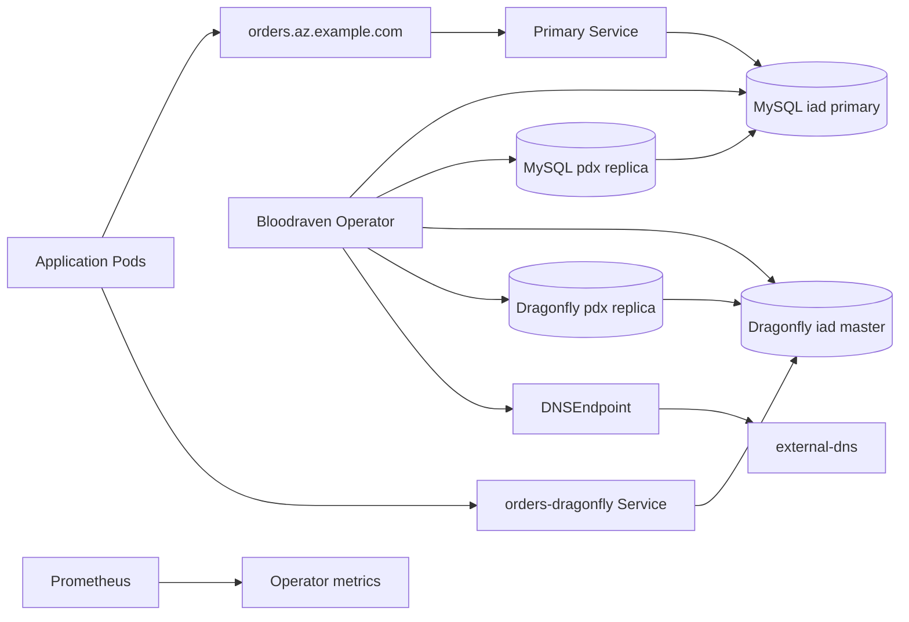
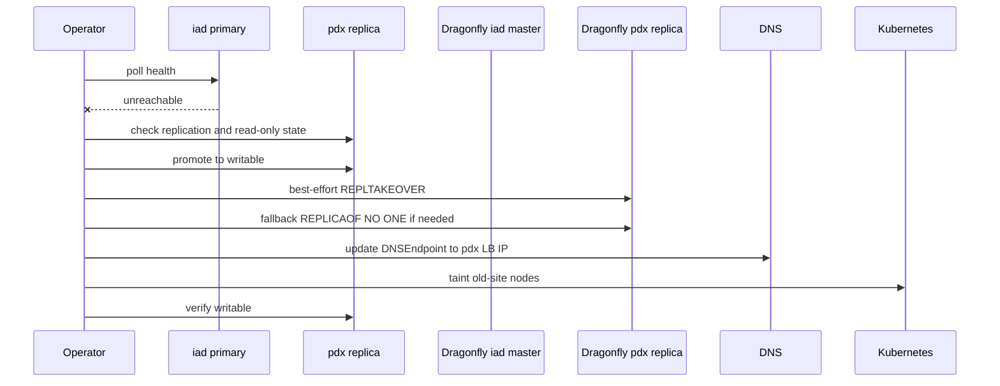
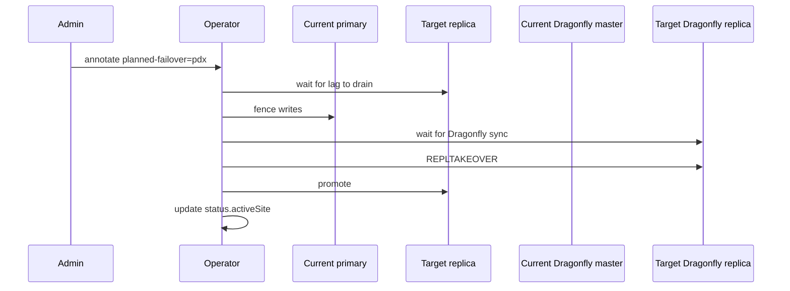
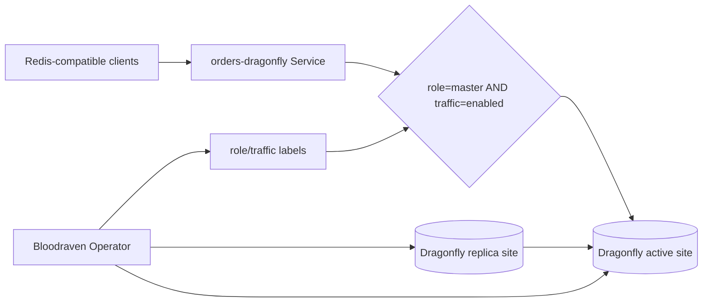
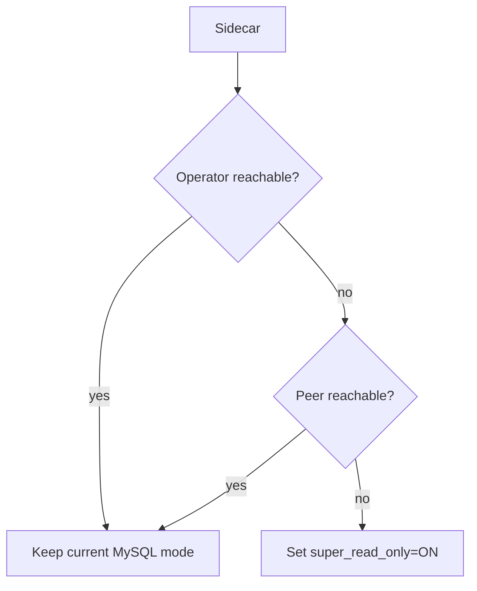
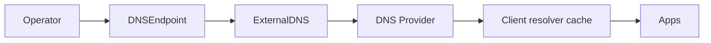
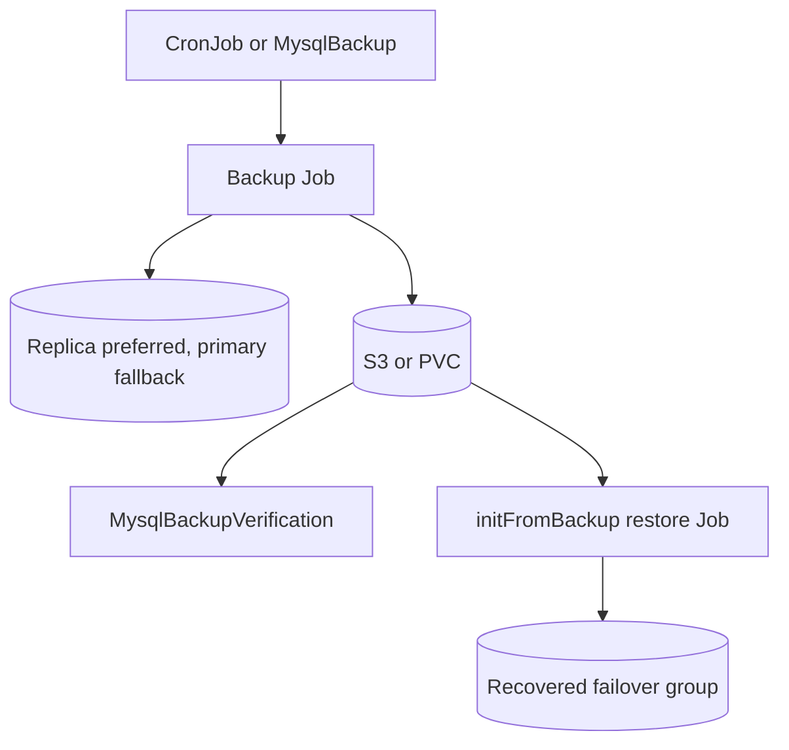
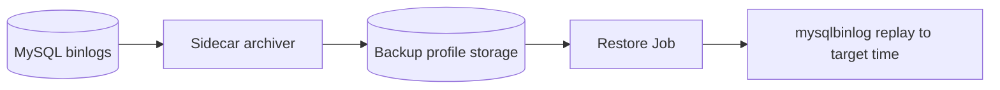
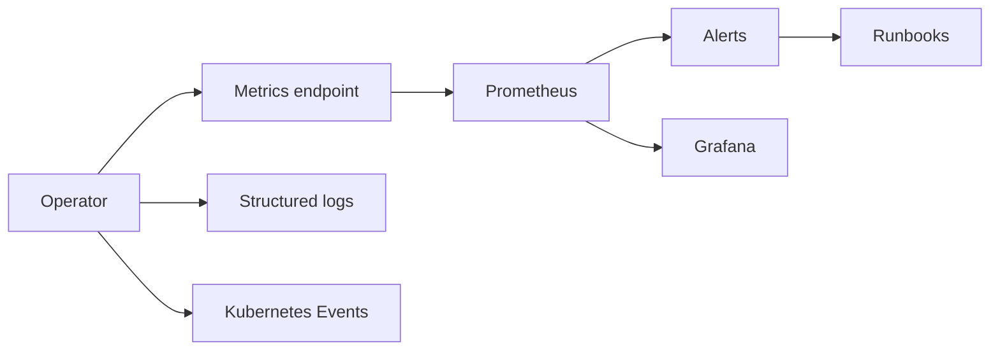

These diagrams are source-controlled as Mermaid so they can be edited with docs changes.

## Normal two-site topology

## Emergency failover path

## Planned failover path

## Dragonfly active Service

## Sidecar self-fencing

## DNS steering

## Backup and restore flow

## PITR binlog archival

## Monitoring and alerting flow

