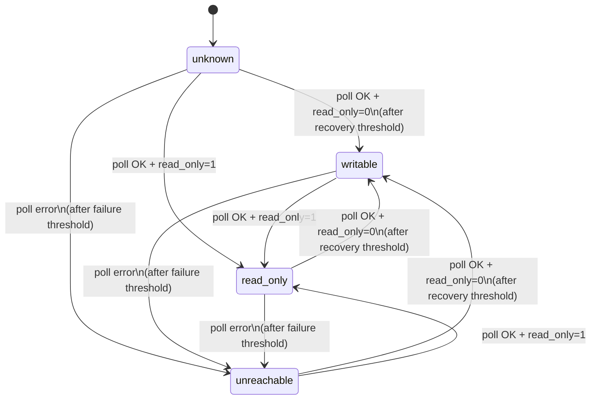
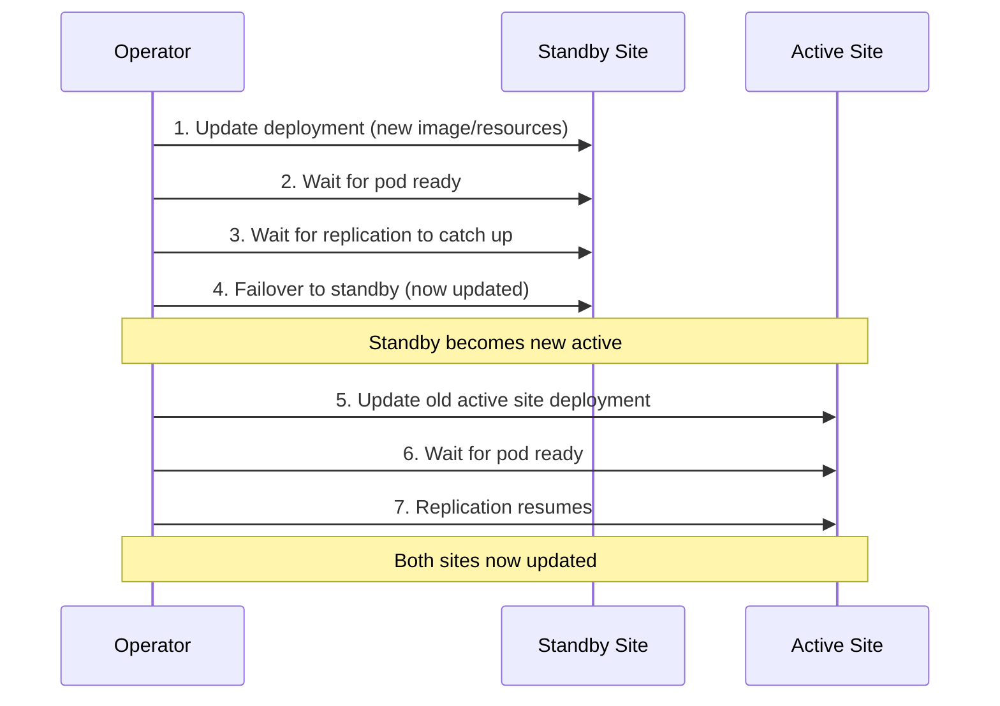

This page covers the state machine that drives MySQL failover decisions, the exact sequence of operations during a failover, Dragonfly follow-along behavior when enabled, the anti-flap cooldown, and ordered updates for zero-downtime rollouts. For the bounded-RPO contract and the exact set of transactions that can be lost on emergency failover, see [Durability and RPO](/docs/architecture/durability-and-rpo). For what happens when the operator itself is unavailable during a failure, see [Operator availability](/docs/architecture/operator-availability).

## State machine

Each site in a failover group is tracked independently. The possible states are:

| State | Meaning |
|---|---|
| `unknown` | Initial state before the first successful poll |
| `writable` | MySQL is reachable and `read_only=0` |
| `read-only` | MySQL is reachable and `read_only=1` |
| `unreachable` | MySQL has failed the configured number of consecutive polls |

### State transitions



**Debouncing:**

- A site transitions to `unreachable` only after **failureThreshold** consecutive failed polls (default: 3). For the first fault in an otherwise healthy group, the default 2-second base interval means about 6 seconds of downtime before the operator considers the site unreachable.
- A site transitions to `writable` only after **recoveryThreshold** consecutive successful polls showing `read_only=0` (default: 2). This prevents premature promotion on transient successes.
- Transitions to `read-only` are immediate (single poll) since this is a safe, non-destructive state.

`spec.pollInterval` is a base interval, not a permanently flat cadence. Once
any site has reached `failureThreshold` and continues to fail, the shared group
poll loop backs off exponentially: with the defaults, later intervals progress
from 2 seconds to 4, 8, 16, and then the 30-second cap. A successful probe
resets that site's failure count, and the next interval returns to the base
when no other site remains in backoff.

This does not delay detection of the first isolated failure: the backoff starts
only after the site is already `unreachable`. It does affect compound outages.
If one site has been down long enough for polling to reach the 30-second cap, a
second site that fails can take three capped polls, or up to about 90 seconds,
to reach the default `failureThreshold`. Use that bound for alerting and
compound-failure recovery estimates.

### Cross-site evaluation

After updating individual site states, the operator evaluates the pair together:

| Site A | Site B | Action |
|---|---|---|
| `writable` | `read-only` | **Healthy** -- no action needed |
| `unreachable` | `read-only` | **Promote Site B** -- the `Degraded` condition reason is `Degraded` until topology converges |
| `read-only` | `unreachable` | **Promote Site A** -- the `Degraded` condition reason is `Degraded` until topology converges |
| `writable` | `writable` | **Split brain** -- see [Split-brain resolution](#split-brain-resolution) |
| `read-only` | `read-only` | **No primary** -- alert, no automatic action (with one exception, below) |
| `unreachable` | `unreachable` | **Total loss** -- alert, no automatic action |

The operator only takes automatic action for the failover case (and, opt-in, for split brain). All other anomalous states require human investigation.

`Failover` is not a `Degraded` condition reason. Alert on
`Degraded=True, reason=Degraded` for this topology state, on the
`FailoverExecuted` Kubernetes Event for a completed promotion, or on an
increase in `bloodraven_failovers_total`. A condition alert that matches
`reason=Failover` never fires because the operator does not emit that value.

The table is the two-candidate core reduced to two columns. In an N-site
group, only `primary-candidate` sites can be the active site, promotion target,
or split-brain winner. `dr-only` and `read-only` sites are non-promotable. A
writable non-promotable site is an anomaly and is fenced on every poll; a
reader is fenced even when it is the sole writable site. Reader outages and
replication failures remain visible per site but are excluded from group
readiness and degradation calculations. Readers never trigger node taint
changes or become active DNS targets.

**Exception — re-asserting a fenced promoted primary.** A freshly promoted primary can be fenced back to read-only by its own sidecar: the sidecar's fencing lease may still be stale when the promotion lands (for example, the operator restarted after a full-site outage and promoted before its auxiliary Service endpoint became Ready, so the sidecar's operator probes kept failing while the operator was already driving MySQL). That leaves every site reachable and read-only — a state the table above refuses to touch, because without history it is indistinguishable from a fresh-start condition that needs human input.

The operator, however, does have history: `status.lastFailoverTarget` names the site it made authoritative. When **all** of the following hold, the operator restores writability on that site instead of alerting and waiting:

- a prior failover is recorded and its target is reachable, read-only, and a `primary-candidate`;
- every other site is also reachable and read-only (an unreachable site hands the decision back to the normal failover row above);
- the target contains every other site's `GTID_EXECUTED` and the recorded `status.promotionGtidExecuted` — restoring it cannot lose transactions or create a second primary.

The re-assert is rate-limited to once per `failoverCooldown`, logs `re-asserting fenced promoted primary` (see the [log schema](/docs/observability/log-schema)), and increments `bloodraven_primary_reassert_total`. GTID divergence between the sites still blocks it — that genuinely needs a human.

## Failover sequence

When the operator decides to fail over to a candidate site, it executes these
steps in order:

1. **Best-effort fence the old primary** with
   `SET GLOBAL super_read_only=ON`. If no old-primary connection is available,
   the sequence continues because the failed site is already isolated from the
   operator.
2. **Best-effort evict application connections from the old primary** so
   clients reconnect through the primary Service or DNS. A failure is logged
   and does not block promotion.
3. **Drain relay logs on the candidate**, bounded by 30 seconds. A timeout or
   drain error is logged and promotion continues; the drain narrows the normal
   asynchronous-replication RPO but is not a zero-RPO gate.
4. **Stop replication on the candidate** with `STOP REPLICA`. Failure stops
   the promotion attempt.
5. **Remove the candidate's replication configuration** with
   `RESET REPLICA ALL`. Failure stops the promotion attempt.
6. **Capture the promotion GTID** with `SELECT @@global.gtid_executed` before
   the candidate accepts writes. A read failure is logged and leaves the
   recorded value empty; it does not stop promotion.
7. **Clear `super_read_only` on the candidate**. This is required because a
   sidecar or earlier fence may have set it. Failure stops the promotion.
8. **Clear `read_only` on the candidate**, making it writable. Failure stops
   the promotion.
9. **Confirm writability immediately** with a bounded `read_only` probe. This
   is part of the same promotion attempt, not the next topology poll. If the
   probe fails, DNS and failover bookkeeping are not advanced, although the
   preceding write may already have made MySQL writable.
10. **Record and publish the promotion**. The operator records anti-flap and
    promotion-GTID state and increments `bloodraven_failovers_total` before it
    best-effort updates the `DNSEndpoint`. A DNS write failure does not undo a
    successful MySQL promotion; poll-driven DNS reconciliation keeps retrying.
    Dragonfly follow-along, when enabled, starts after this MySQL path.

Node taints, the `-primary` Service selector, and follower source convergence
are poll-driven consequences rather than steps inside
`FailoverController.Execute`. The old site's transition to `unreachable`
applies its taint before promotion. Later successful polls debounce the new
primary to `writable` and remove its taint; the status update then lets the
resource reconciler move pod role labels and Service endpoints. Direct-source
convergence separately verifies and repairs each remaining follower after
replica status collection.

## Direct-source convergence

Source convergence runs after replica status collection and outside the
promotion sequence. It is therefore able to repair a healthy wrong source
after an operator restart even when no failover history exists. Mutation is
allowed only when there is exactly one writable `primary-candidate`, no second
writable site, and no bootstrap, update, restore, topology freeze, pending
promotion, planned failover, or split brain in flight.

For a wrong non-empty source, Bloodraven:

1. Verifies that the active primary's `GTID_EXECUTED` contains the follower's
   executed set.
2. Runs `STOP REPLICA` and repeats both GTID reads and the containment check,
   closing the race where the SQL applier advances after the first check.
3. Runs `CHANGE REPLICATION SOURCE TO` with the configured credentials and TLS
   settings, without `RESET REPLICA ALL`.
4. Runs `START REPLICA` and boundedly verifies the direct canonical hostname
   and both replication threads.

If containment fails, status becomes `Blocked/GTIDDiverged` and no unsafe
repoint occurs. A post-STOP containment failure leaves replication stopped.
Other bounded failures remain `Pending/MutationFailed` for a later safe retry.
This generic state is recorded in `sourceHost`, `sourceConvergenceState`, and
`sourceConvergenceReason`; it does not replace old-primary
`recoveryState`/`divergentGtid` reporting.

## Dragonfly during failover

When `spec.dragonfly.enabled=true`, Dragonfly follows the MySQL failover group but remains best-effort cache/session state, not durable data.

During **planned failover**, Bloodraven inserts two Dragonfly phases before MySQL promotion:

1. `WaitingForDragonflySync` captures the source Dragonfly replication offset and waits for the target Dragonfly replica to catch up, bounded by `spec.dragonfly.plannedFailover.maxSyncWait` (default `30s`).
2. `PromotingDragonfly` removes the source pod's `shipstream.io/dragonfly-traffic` label, promotes the target with `REPLTAKEOVER`, stamps the target as `shipstream.io/dragonfly-role=master`, and best-effort kills old-master clients so they reconnect through the active Dragonfly Service.

If sync or `REPLTAKEOVER` fails, `spec.dragonfly.plannedFailover.onSyncTimeout` controls the outcome. The default `proceed` continues MySQL promotion and records `status.plannedFailover.dragonfly.sessionsPreserved=false`. `fail` rolls back before MySQL promotion and leaves the original MySQL primary active.

During **emergency failover**, MySQL promotion is the priority. After MySQL promotion succeeds, the operator attempts to promote Dragonfly on the new MySQL active site within a bounded budget. It first tries `REPLTAKEOVER` to preserve sessions; if that fails, it falls back to `REPLICAOF NO ONE`, which restores a writable Dragonfly master but does not guarantee session continuity. That fallback emits Warning Events `DragonflyPromotionCompleted` and `DragonflySessionsLost` and increments `bloodraven_dragonfly_promotions_total{result="sessions_lost"}`. It never returns an error to the MySQL path. If Dragonfly is unreachable, MySQL recovery still completes.

The Dragonfly manager also handles Dragonfly-only failures. If the active Dragonfly master dies while MySQL remains healthy, the manager can promote the single healthy Dragonfly replica and leave `status.activeSite` for MySQL unchanged.

## Old primary recovery

After an emergency failover, the old primary may come back online. The operator automatically detects this and takes action based on whether the old primary's data has diverged from the new primary.

### Detection

On each poll cycle, if a site is read-only with no active replication (the signature of a former primary) while another site is the directly confirmed writable primary, the operator initiates recovery. Recovery is deliberately **not** gated on a recorded failover: a primary can change hands without one (a replica respawns writable and is adopted while the old primary respawns fenced, or the failover record was lost to a status-write outage plus an operator restart), and the orphaned ex-primary still needs to rejoin.

Only a **genuinely fresh datadir** is skipped and left to bootstrap/auto-clone. Freshness is decided from GTID history, not from the absence of user schemas: a site whose `GTID_EXECUTED` UUIDs share nothing with the new primary (server-init transactions under a brand-new `server_uuid`) may still be treated as empty when it also has no user schemas. A returning cluster member always carries the cluster's shared UUIDs, so a schemaless but previously participating site still runs the divergence comparison — never a silent clone-over. If the new primary cannot be probed for this check, the operator fails safe toward recovery rather than toward the fresh-datadir path. The sequence:

1. **Fence** the returning site with `SET GLOBAL super_read_only=ON` (defensive — the sidecar may have already fenced it)
2. **Drain application sessions** until a pass finds none or `spec.connectionDrainTimeout` elapses (default `30s`). Each topology poll performs at most one bounded eviction pass, so recovery waits without blocking failure detection or failover progress. This runs after promotion, so it cannot kill the operator's promotion session. A timeout does not block recovery because the fence prevents writes; any survivor is limited to stale reads.
3. **Query `@@global.gtid_executed`** on both the old and new primary
4. **Compare GTID sets** to determine if the old primary has any transactions not on the new primary

If the old primary returns **writable** (e.g., power was cut before the sidecar could self-fence), the operator first detects this as a split-brain condition and fences it immediately. The fence is retried on **every** poll cycle while the split-brain persists — a transient error on the first attempt (a network blip during the site's recovery turbulence) does not leave the returning site writable. Recovery proceeds once the site transitions to read-only.

### No divergence (automatic rejoin)

If the new primary's GTID set contains all transactions from the old primary, there is no data loss. The operator automatically reconfigures the old primary as a replica:

1. `SET GLOBAL super_read_only=ON`
2. `STOP REPLICA`
3. `RESET REPLICA ALL`
4. `CHANGE REPLICATION SOURCE TO ... SOURCE_AUTO_POSITION=1`
5. `START REPLICA`

While the sequence runs, `status.sites[].recoveryState` is `RecoveryInProgress` and the `RecoveryPending` condition is `True` with reason `RecoveryInProgress`. The operator keeps that state until MySQL reports healthy replication and the bounded application-connection drain has completed, then writes `replicating=true` and `gtidExecuted` for the read-only site and clears recovery state.

### Divergence detected (manual intervention required)

If the old primary has committed transactions that never replicated to the new primary, the operator:

- Keeps the site **fenced** (`super_read_only=ON`)
- Records the divergent GTID set and transaction count in `status.sites[].divergentGtid` and `status.sites[].divergentTransactionCount`
- Sets `status.sites[].recoveryState` to `RecoveryBlocked`
- Sets the `RecoveryPending` condition to `True` with reason `DivergentTransactions`
- Emits the `bloodraven_divergent_transactions` Prometheus metric

While a site is `RecoveryBlocked`, the operator re-verifies the divergence roughly every 30 seconds rather than freezing the first report. If the site diverges *further* before you resolve it (for example its pod respawned writable, accepted a few writes, and was re-fenced), `divergentGtid` and the count refresh to the full current set. A writable observation does not erase that evidence unless the site is both the recorded failover target and the unique, directly confirmed writable primary; split-brain remains blocked. If the divergence is resolved externally — you replay the missing transactions onto the new primary so its GTID set comes to contain the old primary's — the re-check notices containment and automatically rejoins the site as a replica.

::caution

Divergent transactions mean the old primary accepted writes that the new primary never received. These transactions are effectively lost from the replication stream. There are exactly two sanctioned ways out: **re-clone** the site from the current primary (discarding the divergent transactions after you have extracted what you need), or **replay the divergent transactions onto the new primary** so its GTID set comes to contain the old primary's — the periodic re-verification then rejoins the site automatically. Do not manually reconfigure replication on the divergent site — conflicting GTID sets will cause replication errors.
::
To recover a divergent site:

1. Investigate the divergent transactions to understand what data was lost (check `status.sites[].divergentGtid`)
2. Trigger a reclone using the annotation, including the first 8+ characters of the observed `divergentGtid` as a confirmation token:

   ```bash
   # Read the divergent GTID first:
   kubectl get mysqlfailovergroup <name> -o jsonpath='{.status.sites[?(@.name=="<site>")].divergentGtid}'
   # Then annotate with <site>:<prefix-of-divergentGtid>:
   kubectl annotate mysqlfailovergroup <name> bloodraven.shipstream.io/reclone-site=<site>:<gtid-prefix>
   ```

3. The operator validates that the prefix matches the observed `divergentGtid` — a mismatch is rejected with a `RecloneRejected` Warning Event, so a fat-fingered site name can't destroy the wrong replica. When a site has **no** `divergentGtid` (cold reclone: PVC loss, manual rebuild), use `kubectl bloodraven reclone <group> <site> --cold` to provide the required destructive confirmation.
4. The operator runs `CLONE INSTANCE` on the target site, replacing all data with a fresh copy from the current primary. A `RecloneRequested` Event marks the start.

See [Recovering a divergent old primary](/docs/operations/operations#recovering-a-divergent-old-primary) for the full procedure.

### Prerequisites

Old primary recovery requires replication credentials (`MYSQL_REPLICATION_USER` and `MYSQL_REPLICATION_PASSWORD`) in the Secret referenced by `spec.secretName`. Without these, recovery is skipped and the site remains fenced.

## Split-brain resolution

When the state machine observes both sites as `writable` simultaneously, the operator's response is tiered:

1. **After a prior operator-initiated failover** -- The operator already knows which site it promoted (`status.lastFailoverTarget`). The other site being writable means the old primary returned. The operator fences it immediately (`SET GLOBAL super_read_only=ON`) and recovery proceeds on the next poll. This runs regardless of `spec.splitBrainPolicy`.
2. **No prior failover history, `spec.splitBrainPolicy.sitePriorities` is non-empty** -- The first listed site that is currently writable wins. The operator fences every other writable site and re-promotes the winner through the standard failover path. The anti-flap cooldown still applies to this promotion.
3. **No prior failover history, no priorities configured** -- The operator alerts only (`SPLIT BRAIN: both sites are writable`) and takes no automated action. This is the default.

### When `sitePriorities` applies

`sitePriorities` is an ordered tiebreaker for states the operator cannot resolve from its own history. The two common triggers:

- **Fresh deploy with existing data.** Both sites come up writable and `lastFailoverTarget` is empty because this operator instance has never failed anything over. Without `sitePriorities`, the operator alerts and waits for an admin.
- **Operator restart amnesia.** In-memory `lastFailoverTarget` is repopulated at startup from the newer of `status.lastFailoverTarget` and the out-of-band annotation (see [Where the cooldown is stored](#where-the-cooldown-is-stored)), so a failure on either durable path no longer costs the operator its history. But if a split brain occurred during the restart window — for example, an old primary came back *while* the operator was restarting — the operator may never have had an opportunity to record the most recent failover at all. `sitePriorities` provides a deterministic answer in this case.

When history *is* available (case 1 above), the operator trusts it and does **not** consult `sitePriorities`. This preserves the invariant that the site most recently promoted keeps its writes.

### Configuration

```yaml
apiVersion: shipstream.io/v1alpha1
kind: MysqlFailoverGroup
metadata:
  name: orders
spec:
  sites:
    - name: iad
      # ...
    - name: pdx
      # ...
  splitBrainPolicy:
    sitePriorities: [iad, pdx]  # iad wins when writable; pdx is next
```

Every entry must match a `primary-candidate` in `spec.sites`; the CRD's CEL validation rejects other names and non-promotable sites at admission time. An empty or omitted list leaves unresolvable split brain in alert-only mode.

### Data-loss implications

::caution

`sitePriorities` is a **policy** decision, not a safety feature. When the operator fences a losing site to resolve a split brain:

- Any transactions committed on the losing site that did *not* replicate to the winner are isolated.
- Those transactions are *not* automatically replayed, merged, or preserved. They remain on the losing site's PVC but are outside the replication stream.
- When the fenced site attempts to rejoin, Bloodraven's existing divergent-GTID detection compares `executed_gtid_set` on both sides. If the loser has GTIDs the winner never saw, rejoin is **blocked** and the site must be recloned to recover. The divergent GTID set and transaction count are recorded in `status.sites[].divergentGtid` and `status.sites[].divergentTransactionCount`.
- In other words, `sitePriorities` makes split-brain resolution fast and deterministic by selecting one history branch. The loser's unreplicated writes are isolated and surfaced through the `RecoveryBlocked` condition and `bloodraven_divergent_transactions` gauge, but they are not merged into the winner.
::
Configure `sitePriorities` only when your operational model has a clear authority order -- for example, a primary region that should win whenever it is writable, followed by explicit fallback regions.

### Observability

- Metric: `bloodraven_split_brain_auto_resolve_total{prefer_site="<name>"}` -- counter, incremented for a successful losing-site fence; the retained label name identifies the winning site.
- Log event: `split-brain auto-resolve: fencing non-preferred site per spec.splitBrainPolicy.sitePriorities` at `WARN`, with `winner` and `fencedSite` fields.
- The standard failover log, metric (`bloodraven_failovers_total`), and DNS-flip metric (`bloodraven_dns_flips_total`) also fire, since split-brain resolution runs through the same promotion path.

## Anti-flap cooldown

To prevent rapid failover oscillation (e.g., a flapping network link), the operator enforces a cooldown period between automatic failovers. The default is 5 minutes, configurable via `spec.failoverCooldown`.

During the cooldown:

- The operator continues to monitor both sites and update status
- Automatic failovers are suppressed
- Manual intervention can still be performed (see [Operations](/docs/operations/operations))

The cooldown timer resets after each failover.

### Where the cooldown is stored

The last failover time and target are written to two places on every promotion, so an operator restart cannot silently reset the cooldown:

| Location | Written by |
|---|---|
| `status.lastFailover`, `status.lastFailoverTarget` | the per-poll CR status update |
| `bloodraven.shipstream.io/last-failover`, `bloodraven.shipstream.io/last-failover-target` annotations | a merge patch issued inline with the promotion |

The two travel different API paths — the status subresource has its own RBAC rule and admission chain — so an outage on one does not take the other with it. Both writes retry every poll until accepted, and a restarting operator rehydrates from whichever copy carries the later timestamp.

A restart that had to fall back to the annotations logs `restored lastFailover from out-of-band annotations` at WARN. That means this group's status writes were failing when it last promoted, and is worth alerting on. Losing the cooldown across a restart requires **both** paths to be rejecting writes at once; see [Known limitations](/docs/get-started/known-limitations) → Operator availability.

The annotations are operator-owned bookkeeping. Editing or removing them by hand changes what a restart believes about the cooldown; the running process keeps its in-memory value either way and rewrites both copies on its next promotion.

## Ordered updates

When `spec.updateStrategy` is set to `OrderedUpdate`, spec changes (such as a new `image`, effective per-site MySQL config, or resource adjustments) are rolled out with zero downtime:



This sequence ensures:

- The active primary is never restarted while serving traffic
- Replication is healthy before each transition
- At most one site is unavailable at any time

For groups with more than two sites, every drifted non-active follower is
updated sequentially and must be read-only with a direct healthy source before
and after restart. If the active site has no drift, the rollout completes
without failover; this is the normal reader-only configuration path. If the
active site is drifted, only a healthy `primary-candidate` standby may receive
the handoff. A reader or `dr-only` follower is never promoted to facilitate an
update, and failed or unprocessed drift remains queued for a later reconcile.

Without `OrderedUpdate`, both sites are updated simultaneously, which may cause brief downtime if both pods restart at the same time.

For MySQL image changes, see the [Upgrade and version-skew policy](/docs/operations/upgrade-policy). The replica-first ordering above is the MySQL-required direction for a rolling version upgrade.
