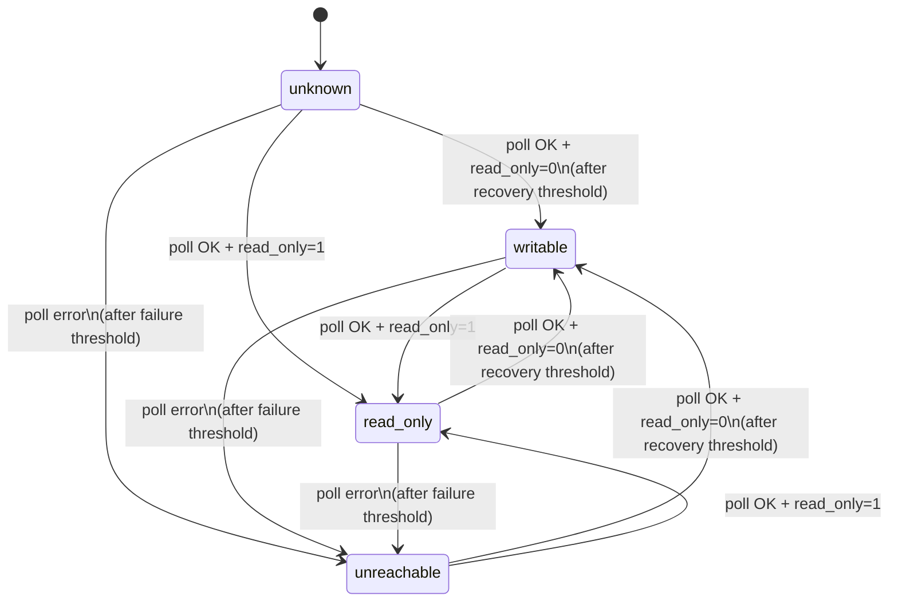
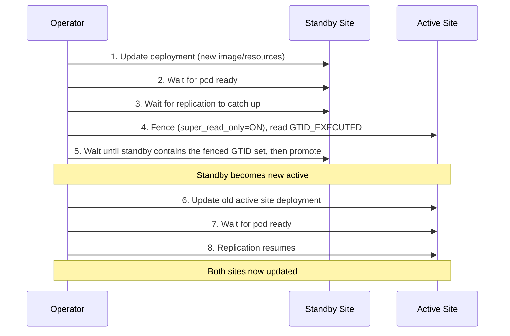

This page covers the state machine that drives MySQL failover decisions, the exact sequence of operations during a failover, Dragonfly follow-along behavior when enabled, the anti-flap cooldown, and ordered updates for zero-downtime rollouts. For the bounded-RPO contract and the exact set of transactions that can be lost on emergency failover, see [Durability and RPO](/docs/architecture/durability-and-rpo). For what happens when the operator itself is unavailable during a failure, see [Operator availability](/docs/architecture/operator-availability).

## State machine

Each site in a failover group is tracked independently. The possible states are:

| State | Meaning |
|---|---|
| `unknown` | Initial state before the first successful poll |
| `writable` | MySQL is reachable and `read_only=0` |
| `read-only` | MySQL is reachable and `read_only=1` |
| `unreachable` | MySQL has failed the configured number of consecutive polls |

### State transitions


```mermaid
stateDiagram-v2
    [*] --> unknown
    unknown --> writable: poll OK + read_only=0\n(after recovery threshold)
    unknown --> read_only: poll OK + read_only=1
    unknown --> unreachable: poll error\n(after failure threshold)
    writable --> read_only: poll OK + read_only=1
    writable --> unreachable: poll error\n(after failure threshold)
    read_only --> writable: poll OK + read_only=0\n(after recovery threshold)
    read_only --> unreachable: poll error\n(after failure threshold)
    unreachable --> writable: poll OK + read_only=0\n(after recovery threshold)
    unreachable --> read_only: poll OK + read_only=1
```

**Debouncing:**

- A site transitions to `unreachable` only after **failureThreshold** consecutive failed polls (default: 3). For the first fault in an otherwise healthy group, the default 2-second base interval means about 6 seconds of downtime before the operator considers the site unreachable.
- A site transitions to `writable` only after **recoveryThreshold** consecutive successful polls showing `read_only=0` (default: 2). This prevents premature promotion on transient successes.
- Transitions to `read-only` are immediate (single poll) since this is a safe, non-destructive state.

`spec.pollInterval` is the poll loop's cadence, and every site that is
reachable is probed on every poll. A site that has reached `failureThreshold`
and keeps failing is probed less often: with the defaults its probes back off
from 2 seconds to 4, 8, 16, and then a 30-second cap. The backoff is per site.
A site that stays down does not slow the probes of any other site, so the
primary's loss is still detected in about 6 seconds while a reader or DR site
is down. A successful probe resets that site's failure count and returns it to
the base interval.

The backoff does delay noticing that a long-down site has come back: its next
probe can be up to 30 seconds away. The sidecar's self-fencing rules cover a
returning old primary during that window.

### Cross-site evaluation

After updating individual site states, the operator evaluates the pair together:

| Site A | Site B | Action |
|---|---|---|
| `writable` | `read-only` | **Healthy** -- no action needed |
| `unreachable` | `read-only` | **Promote Site B** -- the `Degraded` condition reason is `Degraded` until topology converges |
| `read-only` | `unreachable` | **Promote Site A** -- the `Degraded` condition reason is `Degraded` until topology converges |
| `writable` | `writable` | **Split brain** -- see [Split-brain resolution](#split-brain-resolution) |
| `read-only` | `read-only` | **No primary** -- alert, no automatic action (with one exception, below) |
| `unreachable` | `unreachable` | **Total loss** -- alert, no automatic action |

The operator only takes automatic action for the failover case (and, opt-in, for split brain). All other anomalous states require human investigation.

`Failover` is not a `Degraded` condition reason. Alert on
`Degraded=True, reason=Degraded` for this topology state, on the
`FailoverExecuted` Kubernetes Event for a completed promotion, or on an
increase in `bloodraven_failovers_total`. A condition alert that matches
`reason=Failover` never fires because the operator does not emit that value.

The table is the two-candidate core reduced to two columns. In an N-site
group, only `primary-candidate` sites can be the active site, promotion target,
or split-brain winner. `dr-only` and `read-only` sites are non-promotable. A
writable non-promotable site is an anomaly and is fenced on every poll; a
reader is fenced even when it is the sole writable site. Reader outages and
replication failures remain visible per site but are excluded from group
readiness and degradation calculations. Readers never trigger node taint
changes or become active DNS targets.

**Exception — re-asserting a fenced promoted primary.** A freshly promoted primary can be fenced back to read-only by its own sidecar: the sidecar's fencing lease may still be stale when the promotion lands (for example, the operator restarted after a full-site outage and promoted before its auxiliary Service endpoint became Ready, so the sidecar's operator probes kept failing while the operator was already driving MySQL). That leaves every site reachable and read-only — a state the table above refuses to touch, because without history it is indistinguishable from a fresh-start condition that needs human input.

The operator, however, does have history: `status.lastFailoverTarget` names the site it made authoritative. When **all** of the following hold, the operator restores writability on that site instead of alerting and waiting:

- a prior failover is recorded and its target is reachable, read-only, and a `primary-candidate`;
- every other site is also reachable and read-only, both in the operator's debounced state and on a live `@@read_only` read just before the re-assert (an unreachable site hands the decision back to the normal failover row above);
- the target contains every other site's `GTID_EXECUTED` and the recorded `status.promotionGtidExecuted` — restoring it cannot lose transactions or create a second primary.

A group that has never failed over gets the same protection for the last site the operator saw as its unique writable primary (`status.activeSite` survives an operator restart, unless it was already empty), with one limit. A site the operator only *observed* as primary is lifted only from the `read_only=ON` every `mysqld` boots with (`super_read_only` OFF), never from a fence: a self-fenced primary with no failover history still waits for a human. Every `mysqld` starts with `read_only=ON`, so a primary whose MySQL container restarts comes back read-only and is re-asserted on the next poll. A site the operator made primary itself is re-asserted from any fence, as a failover target is: the fresh-deploy bootstrap reports its seed as the active site the moment it makes the seed writable, so a seed fenced by its own sidecar's startup safety net is re-asserted the same way. The log line's `authority` field says which applied: `lastFailoverTarget` or `lastActiveSite`.

The re-assert is rate-limited to once per `failoverCooldown`, logs `re-asserting fenced promoted primary` (see the [log schema](/docs/observability/log-schema)), and increments `bloodraven_primary_reassert_total`. GTID divergence between the sites still blocks it — that genuinely needs a human. The one exception is a peer that already carries a divergence report ([Divergent replicas](#divergent-replicas)): its recorded `divergentGtid` is not held against the target, because those transactions are already reported, stay on the peer, and are re-audited against the re-asserted primary. Without it, an emergency failover that deliberately promoted a clean candidate over that peer could never re-assert the candidate after a fence-back. Anything the peer holds beyond its recorded set still blocks the re-assert.

## Failover sequence

**Choosing the candidate.** Among the reachable `primary-candidate` sites the
operator reads every candidate's `GTID_EXECUTED` and promotes the most
caught-up one; priority order breaks ties. A candidate that is empty in a
group that holds data, or that lacks `status.promotionGtidExecuted`, is
refused. A candidate carrying a divergence report (see
[Divergent replicas](#divergent-replicas)) ranks below every candidate without
one, even when it has the fresher set: the freshest clean candidate wins
(logged `failover picker: skipping divergent candidate`). Preferring it can
leave transactions that only the divergent site holds, legitimate ones
included, off the new primary; the divergent site keeps its report, so they
are not silently dropped. Divergence never blocks an emergency failover: when
only divergent candidates remain, the freshest of them is promoted with an
ERROR `failover picker: promoting a divergent candidate; no other candidate remains`,
and once it is the confirmed primary the operator records the
`DivergentPromotion` status condition and a `DivergentSitePromoted` Warning
Event naming the set that became authoritative. The condition stays until an
administrator removes it. A further divergent promotion before that is added
to the same condition, newest last; it keeps the five newest records and says
when older ones were dropped (the Events and the operator log keep all of
them).

When the operator decides to fail over to a candidate site, it executes these
steps in order:

1. **Best-effort fence the old primary** with
   `SET GLOBAL super_read_only=ON`. If no old-primary connection is available,
   the sequence continues because the failed site is already isolated from the
   operator.
2. **Best-effort evict application connections from the old primary** so
   clients reconnect through the primary Service or DNS. A failure is logged
   and does not block promotion.
3. **Drain relay logs on the candidate**, bounded by 30 seconds. The drain is
   complete once `Executed_Gtid_Set` contains the `Retrieved_Gtid_Set` the
   candidate had when the drain began, so it returns as soon as the backlog
   already received is applied and does not wait on a receiver that is still
   fetching. A stopped SQL thread with pending relay log is restarted once.
   An IO-thread error, such as the connect error a candidate reports once its
   primary is dead, does not end the drain; only an applier (SQL thread)
   error does. A timeout or drain error is logged and promotion continues;
   the drain narrows the normal asynchronous-replication RPO but is not a
   zero-RPO gate.
4. **Stop replication on the candidate** with `STOP REPLICA`. Failure stops
   the promotion attempt.
5. **Remove the candidate's replication configuration** with
   `RESET REPLICA ALL`. Failure stops the promotion attempt.
6. **Capture the promotion GTID** with `SELECT @@global.gtid_executed` before
   the candidate accepts writes. A read failure is logged and leaves the
   recorded value empty; it does not stop promotion.
7. **Clear `super_read_only` on the candidate**. This is required because a
   sidecar or earlier fence may have set it. Failure stops the promotion.
8. **Clear `read_only` on the candidate**, making it writable. Failure stops
   the promotion.
9. **Confirm writability immediately** with a bounded `read_only` probe. This
   is part of the same promotion attempt, not the next topology poll. If the
   probe fails, DNS and failover bookkeeping are not advanced, although the
   preceding write may already have made MySQL writable.
10. **Record and publish the promotion**. The operator records anti-flap and
    promotion-GTID state and increments `bloodraven_failovers_total` before it
    best-effort updates the `DNSEndpoint`. A DNS write failure does not undo a
    successful MySQL promotion; poll-driven DNS reconciliation keeps retrying.
    Dragonfly follow-along, when enabled, starts after this MySQL path.

Node taints, the `-primary` Service selector, and follower source convergence
are poll-driven consequences rather than steps inside
`FailoverController.Execute`. The old site's transition to `unreachable`
applies its taint before promotion. Later successful polls debounce the new
primary to `writable` and remove its taint; the status update then lets the
resource reconciler move pod role labels and Service endpoints. Direct-source
convergence separately verifies and repairs each remaining follower after
replica status collection.

## Direct-source convergence

Source convergence runs after replica status collection and outside the
promotion sequence. It is therefore able to repair a healthy wrong source
after an operator restart even when no failover history exists. Mutation is
allowed only when there is exactly one writable `primary-candidate`, no second
writable site, and no bootstrap, update, restore, topology freeze, pending
promotion, planned failover, or split brain in flight.

For a wrong non-empty source, Bloodraven:

1. Verifies that the active primary's `GTID_EXECUTED` contains the follower's
   executed set.
2. Runs `STOP REPLICA` and repeats both GTID reads and the containment check,
   closing the race where the SQL applier advances after the first check.
3. Runs `CHANGE REPLICATION SOURCE TO` with the configured credentials and TLS
   settings, without `RESET REPLICA ALL`.
4. Runs `START REPLICA` and boundedly verifies the direct canonical hostname
   and both replication threads.

If containment fails, status becomes `Blocked/GTIDDiverged` and no unsafe
repoint occurs. A post-STOP containment failure leaves replication stopped.
Other bounded failures remain `Pending/MutationFailed` for a later safe retry.
This generic state is recorded in `sourceHost`, `sourceConvergenceState`, and
`sourceConvergenceReason`; it does not replace the
`recoveryState`/`divergentGtid` reporting of [divergent replicas](#divergent-replicas)
and old primaries.

## Divergent replicas

Healthy replication threads say nothing about whether a replica holds
transactions the primary never had. A replica keeps applying the primary's new
transactions while it carries extra history of its own, until a conflicting row
breaks it. Issue #202 is the example: an ordered update on v1.5.0 promoted a
standby before it received the old primary's last 221 transactions, and the
demoted site then replicated normally with those 221 transactions as errant
GTIDs while the group reported `Ready=True` and `Degraded=False`.

The operator audits every read-only follower with a replication channel,
promotable or not, against the confirmed primary: about every 30 seconds per
site, and immediately on the first poll after the operator starts, the
primary changes, a promotion or handoff completes, a fenced primary is
re-asserted, or a follower's receiver reports a new `Source_UUID` for the
active host (the primary was replaced under the same name). A maintenance
handoff refused because its candidate holds extra transactions makes that
candidate due on the next poll. A failed ordered-update attempt forces
nothing, so a rollout that keeps failing cannot make the audit run every
poll. It reads the follower's `@@server_uuid` and `GTID_EXECUTED`
first and the primary's second, then computes follower minus primary. A
follower's set only grows with transactions that are on the primary first, so
reading in that order never reports a transaction the follower applied between
the two reads. A result is discarded if the primary changed, a promotion or
update began, or either server's `server_uuid` changed while the audit was
reading. A failed or unparseable read changes nothing. The pass runs after the
poll's failure handling. A poll with no follower due probes nothing; when one
is due, confirming the primary and every read share one 5-second budget, so
the audit cannot delay the next poll's failure detection by more than that.
The audit is
skipped while a bootstrap, in-place restore, initial restore, planned
failover, ordered update or pending promotion is in flight.

A non-empty result makes the site divergent:

- `status.sites[].recoveryState` is `RecoveryBlocked`, `divergentGtid` and
  `divergentTransactionCount` describe the extra set,
  `divergenceDetectedBy` is `ReplicaAudit`, and `divergenceComparedTo` names
  the primary it was compared against. Old-primary recovery records the same
  fields with `divergenceDetectedBy=OldPrimaryRecovery`.
- `Degraded` is `True` with reason `DivergentTransactions` and a message
  naming the site, the count and the set. This outranks the lag, thread and
  source-mismatch reasons; split brain, no primary and total loss still win.
  `Ready` is not changed, and the [deployment API](/docs/configuration/deployment-api)
  keeps granting leases: the group is serving, and an integrity warning on a
  replica must not stop application deployments. (A returning old primary's
  block still makes the deployment API report the group unstable, as
  before.)
- `bloodraven_divergent_transactions{site}` is set, the WARN
  `divergence detected` is logged with `detectedBy=ReplicaAudit`, and a
  `DivergentReplicaDetected` Warning Event is emitted on new or changed
  evidence.
- Ordered updates and planned failovers will not promote the site (see
  [Upgrade policy](/docs/operations/upgrade-policy) and
  [Planned failover](/docs/operations/planned-failover)). Emergency failover
  still can, as a last resort.

The block is sticky. Healthy threads, a converged source and an operator
restart do not clear it; a restarted operator restores it from status. Only a
fresh audit proving the follower holds nothing the primary lacks clears it,
logged as `divergence cleared: replica holds no transactions the primary lacks`
with a `DivergenceResolved` Event. If the divergent site itself becomes the
primary, the block is not compared with itself: it becomes the
`DivergentPromotion` condition described under
[Failover sequence](#failover-sequence).

No local transaction is exempt: a `CREATE USER` run on a replica is reported
like an order that never reached the primary, because a GTID set cannot tell
them apart. There are three ways to resolve a divergent replica, and each ends
with the audit clearing the block on its own:

- **Discard the transactions.** Save the errant binlog events first (decode
  them with `mysqlbinlog --include-gtids='<divergentGtid>'` on the replica),
  then reclone the site from the primary:
  `kubectl bloodraven reclone <group> <site>`, which fills in the
  `divergentGtid` prefix the reclone interlock requires (or annotate
  `bloodraven.shipstream.io/reclone-site=<site>:<first 8+ characters of divergentGtid>`).
  Before a block is recorded, a cold reclone uses
  `reclone-site=<site>:confirm=<group>`.
- **Keep the transactions.** Replay the decoded transactions on the primary
  (review them for conflicts first). The primary then holds their GTIDs and
  their rows.
- **Accept the replica's divergence.** When the transactions carry nothing
  the primary needs, commit an empty transaction on the primary for each GTID:
  `SET GTID_NEXT='<uuid>:<n>'; BEGIN; COMMIT;` and finally
  `SET GTID_NEXT='AUTOMATIC';`. This makes the GTID sets agree without moving
  any rows: the replica keeps rows the primary lacks. Once the audit clears,
  the replica is promotable again, and a later promotion makes its rows
  authoritative with no `DivergentPromotion` record. Use it only for
  transactions whose effects are absent from both sites, harmless, or already
  reconciled.

For maintenance on a replica that must not reach the primary's history, run it
with `SET SESSION sql_log_bin=0` so it gets no GTID. There is no setting that
ignores divergence. Playbook 33 in the `bloodraven-doctor` skill walks through
the triage.

## Dragonfly during failover

When `spec.dragonfly.enabled=true`, Dragonfly follows the MySQL failover group but remains best-effort cache/session state, not durable data.

During **planned failover**, Bloodraven inserts two Dragonfly phases before MySQL promotion:

1. `WaitingForDragonflySync` captures the source Dragonfly replication offset and waits for the target Dragonfly replica to catch up, bounded by `spec.dragonfly.plannedFailover.maxSyncWait` (default `30s`).
2. `PromotingDragonfly` removes the source pod's `shipstream.io/dragonfly-traffic` label, promotes the target with `REPLTAKEOVER`, stamps the target as `shipstream.io/dragonfly-role=master`, and best-effort kills old-master clients so they reconnect through the active Dragonfly Service.

If sync or `REPLTAKEOVER` fails, `spec.dragonfly.plannedFailover.onSyncTimeout` controls the outcome. The default `proceed` continues MySQL promotion and records `status.plannedFailover.dragonfly.sessionsPreserved=false`. `fail` rolls back before MySQL promotion and leaves the original MySQL primary active.

During **emergency failover**, MySQL promotion is the priority. After MySQL promotion succeeds, the MySQL poll loop only queues a Dragonfly promotion for the new MySQL active site and carries on; it never waits for the cache. The group's Dragonfly manager runs the promotion on its own goroutine between its polls, so a poll's observation, its status publication and a promotion never overlap. Only the latest queued request is kept; a newer MySQL decision replaces it even while it waits to run. When it runs it is checked against the group as it is then: it is dropped if a planned failover or snapshot upgrade owns Dragonfly, if a decision recorded after it (a planned failover that started, a MySQL failover to another site, or a Dragonfly promotion to another site while MySQL does not name the request's target) points elsewhere, or if its target has already been promoted. If the old Dragonfly master answers a 1s dial and `PING`, the operator tries `REPLTAKEOVER` with a 2s budget to preserve sessions. A takeover is coordinated by the master and cannot complete without it, so an unreachable old master skips straight to the fallback. If the takeover fails or is skipped, the operator falls back to `REPLICAOF NO ONE` on a fresh connection with its own budget: 14s after a failed takeover, because Dragonfly keeps the replica's `REPLICAOF` lock for the takeover budget plus 10s. That restores a writable Dragonfly master but does not guarantee session continuity. That fallback emits Warning Events `DragonflyPromotionCompleted` and `DragonflySessionsLost` and increments `bloodraven_dragonfly_promotions_total{result="sessions_lost"}`. If the fallback cannot be sent after a takeover, or its reply is lost, the outcome is unknown: a takeover can complete on the server after the client gives up. The operator then waits until the server can no longer be acting on the commands (the takeover budget plus 10s, plus 1s) and reads the target's role. A master is recorded as a completed promotion, with the same sessions-lost Events; anything else is a failed promotion, and the old source's traffic label is restored so the active Dragonfly Service is not left empty. Label updates, the role observation and the `status.dragonfly` stamp each get their own 5s budget, so a slow step cannot drop the status update. Every writer of a group's Dragonfly routing (the Dragonfly manager's polls and promotions, the planned failover's Dragonfly phase, the rollout promotion, the replica StatefulSet rollout, each snapshot-upgrade step and the reconciler's label sweep) holds one per-group gate and, after taking it, reads the group uncached from the API server, not from the informer cache, which can lag the previous holder's writes. The manager steps aside for a waiting planned failover or rollout only before it has sent a role-changing command; once `REPLTAKEOVER` or `REPLICAOF NO ONE` is on the wire, the promotion finishes and records its outcome first, even if the manager is being stopped. The gate outlives the manager: when a configuration or credential change restarts a group's managers, the replacement, and any planned failover in the meantime, waits for the old manager's last step. A planned failover that reaches its Dragonfly phase while an emergency promotion has already sent its command therefore waits for it with the MySQL source fenced: about 12-13s in practice (the takeover wait, then the fallback queued behind Dragonfly's lock), about 40s in the worst case with every step at its timeout. It reports the wait in `status.plannedFailover.dragonfly.message` and a Warning Event `DragonflyPromotionWaiting`. The promotion never returns an error to the MySQL path. If Dragonfly is unreachable, MySQL recovery still completes. A rollout promotion of a sync-proven target keeps the `maxSyncWait/2` takeover budget.

The Dragonfly manager also handles Dragonfly-only failures. If the active Dragonfly master dies while MySQL remains healthy, the manager can promote the single healthy Dragonfly replica and leave `status.activeSite` for MySQL unchanged.

## Old primary recovery

After an emergency failover, the old primary may come back online. The operator automatically detects this and takes action based on whether the old primary's data has diverged from the new primary.

### Detection

On each poll cycle, if a site is read-only with no active replication (the signature of a former primary) while another site is the directly confirmed writable primary, the operator initiates recovery. Recovery is deliberately **not** gated on a recorded failover: a primary can change hands without one (a replica respawns writable and is adopted while the old primary respawns fenced, or the failover record was lost to a status-write outage plus an operator restart), and the orphaned ex-primary still needs to rejoin.

Only a **genuinely fresh datadir** is skipped and left to bootstrap/auto-clone. Freshness is decided from GTID history, not from the absence of user schemas: a site whose `GTID_EXECUTED` UUIDs share nothing with the new primary (server-init transactions under a brand-new `server_uuid`) may still be treated as empty when it also has no user schemas. A returning cluster member always carries the cluster's shared UUIDs, so a schemaless but previously participating site still runs the divergence comparison — never a silent clone-over. If the new primary cannot be probed for this check, the operator fails safe toward recovery rather than toward the fresh-datadir path. The sequence:

1. **Fence** the returning site with `SET GLOBAL super_read_only=ON` (defensive — the sidecar may have already fenced it)
2. **Drain application sessions** until a pass finds none or `spec.connectionDrainTimeout` elapses (default `30s`). Each topology poll performs at most one bounded eviction pass, so recovery waits without blocking failure detection or failover progress. This runs after promotion, so it cannot kill the operator's promotion session. A timeout does not block recovery because the fence prevents writes; any survivor is limited to stale reads.
3. **Query `@@global.gtid_executed`** on both the old and new primary
4. **Compare GTID sets** to determine if the old primary has any transactions not on the new primary

If the old primary returns **writable** (e.g., power was cut before the sidecar could self-fence), the operator first detects this as a split-brain condition and fences it immediately. The fence is retried on **every** poll cycle while the split-brain persists — a transient error on the first attempt (a network blip during the site's recovery turbulence) does not leave the returning site writable. Recovery proceeds once the site transitions to read-only.

### No divergence (automatic rejoin)

If the new primary's GTID set contains all transactions from the old primary, there is no data loss. The operator automatically reconfigures the old primary as a replica:

1. `SET GLOBAL super_read_only=ON`
2. `STOP REPLICA`
3. `RESET REPLICA ALL`
4. `CHANGE REPLICATION SOURCE TO ... SOURCE_AUTO_POSITION=1`
5. `START REPLICA`

While the sequence runs, `status.sites[].recoveryState` is `RecoveryInProgress` and the `RecoveryPending` condition is `True` with reason `RecoveryInProgress`. The operator keeps that state until MySQL reports healthy replication and the bounded application-connection drain has completed, then writes `replicating=true` and `gtidExecuted` for the read-only site and clears recovery state.

### Divergence detected (manual intervention required)

If the old primary has committed transactions that never replicated to the new primary, the operator:

- Keeps the site **fenced** (`super_read_only=ON`)
- Records the divergent GTID set and transaction count in `status.sites[].divergentGtid` and `status.sites[].divergentTransactionCount`
- Sets `status.sites[].recoveryState` to `RecoveryBlocked`
- Sets the `RecoveryPending` condition to `True` with reason `DivergentTransactions`, and `Degraded` to `True` with reason `DivergentTransactions`
- Emits the `bloodraven_divergent_transactions` Prometheus metric and a `DataLossDetected` Warning Event
- Excludes the site from ordered-update handoffs and planned failovers, and ranks it last for emergency failover (see [Divergent replicas](#divergent-replicas))

While a site is `RecoveryBlocked`, the operator re-verifies the divergence roughly every 30 seconds rather than freezing the first report. If the site diverges *further* before you resolve it (for example its pod respawned writable, accepted a few writes, and was re-fenced), `divergentGtid` and the count refresh to the full current set. A writable observation does not erase that evidence; split-brain remains blocked. When the site is both the recorded failover target and the unique, directly confirmed writable primary, the report becomes the `DivergentPromotion` condition instead of disappearing. If someone repoints the site's replication by hand, the replica GTID audit takes over re-verifying the report and keeps it until containment is proven; the report keeps `divergenceDetectedBy=OldPrimaryRecovery`, so it still makes the deployment API refuse leases. If the divergence is resolved externally — you replay the missing transactions onto the new primary so its GTID set comes to contain the old primary's — the re-check notices containment and automatically rejoins the site as a replica.

::caution

Divergent transactions mean the old primary accepted writes that the new primary never received. These transactions are effectively lost from the replication stream. There are exactly two sanctioned ways out: **re-clone** the site from the current primary (discarding the divergent transactions after you have extracted what you need), or **replay the divergent transactions onto the new primary** so its GTID set comes to contain the old primary's — the periodic re-verification then rejoins the site automatically. Do not manually reconfigure replication on the divergent site — conflicting GTID sets will cause replication errors.
::
To recover a divergent site:

1. Investigate the divergent transactions to understand what data was lost (check `status.sites[].divergentGtid`)
2. Trigger a reclone using the annotation, including the first 8+ characters of the observed `divergentGtid` as a confirmation token:

   ```bash
   # Read the divergent GTID first:
   kubectl get mysqlfailovergroup <name> -o jsonpath='{.status.sites[?(@.name=="<site>")].divergentGtid}'
   # Then annotate with <site>:<prefix-of-divergentGtid>:
   kubectl annotate mysqlfailovergroup <name> bloodraven.shipstream.io/reclone-site=<site>:<gtid-prefix>
   ```

3. The operator validates that the prefix matches the observed `divergentGtid` — a mismatch is rejected with a `RecloneRejected` Warning Event, so a fat-fingered site name can't destroy the wrong replica. When a site has **no** `divergentGtid` (cold reclone: PVC loss, manual rebuild), use `kubectl bloodraven reclone <group> <site> --cold` to provide the required destructive confirmation.
4. The operator runs `CLONE INSTANCE` on the target site, replacing all data with a fresh copy from the current primary. A `RecloneRequested` Event marks the start.

See [Recovering a divergent old primary](/docs/operations/operations#recovering-a-divergent-old-primary) for the full procedure.

### Prerequisites

Old primary recovery requires replication credentials (`MYSQL_REPLICATION_USER` and `MYSQL_REPLICATION_PASSWORD`) in the Secret referenced by `spec.secretName`. Without these, recovery is skipped and the site remains fenced.

## Split-brain resolution

When the state machine observes both sites as `writable` simultaneously, the operator's response is tiered:

1. **After a prior operator-initiated failover** -- The operator already knows which site it promoted (`status.lastFailoverTarget`). The other site being writable means the old primary returned. The operator fences it immediately (`SET GLOBAL super_read_only=ON`) and recovery proceeds on the next poll. This runs regardless of `spec.splitBrainPolicy`.
2. **No prior failover history, `spec.splitBrainPolicy.sitePriorities` is non-empty** -- The first listed site that is currently writable wins. The operator fences every other writable site and re-promotes the winner through the standard failover path. The anti-flap cooldown still applies to this promotion.
3. **No prior failover history, no priorities configured** -- The operator alerts only (`SPLIT BRAIN: both sites are writable`) and takes no automated action. This is the default.

### When `sitePriorities` applies

`sitePriorities` is an ordered tiebreaker for states the operator cannot resolve from its own history. The two common triggers:

- **Fresh deploy with existing data, on pods that come up writable.** Both sites are writable and `lastFailoverTarget` is empty because this operator instance has never failed anything over. Without `sitePriorities`, the operator alerts and waits for an admin. Every `mysqld` now starts with `--read-only=ON`, so this needs pods from before that flag or a site unfenced by hand; with the flag, the same group comes up all read-only. That is `NoPrimary`, not split brain: the fresh-deploy bootstrap refuses sites that hold data, `sitePriorities` does not apply, and an admin picks the primary.
- **Operator restart amnesia.** In-memory `lastFailoverTarget` is repopulated at startup from the newer of `status.lastFailoverTarget` and the out-of-band annotation (see [Where the cooldown is stored](#where-the-cooldown-is-stored)), so a failure on either durable path no longer costs the operator its history. But if a split brain occurred during the restart window — for example, an old primary came back *while* the operator was restarting — the operator may never have had an opportunity to record the most recent failover at all. `sitePriorities` provides a deterministic answer in this case.

When history *is* available (case 1 above), the operator trusts it and does **not** consult `sitePriorities`. This preserves the invariant that the site most recently promoted keeps its writes.

### Configuration

```yaml
apiVersion: shipstream.io/v1alpha1
kind: MysqlFailoverGroup
metadata:
  name: orders
spec:
  sites:
    - name: iad
      # ...
    - name: pdx
      # ...
  splitBrainPolicy:
    sitePriorities: [iad, pdx]  # iad wins when writable; pdx is next
```

Every entry must match a `primary-candidate` in `spec.sites`; the CRD's CEL validation rejects other names and non-promotable sites at admission time. An empty or omitted list leaves unresolvable split brain in alert-only mode.

### Data-loss implications

::caution

`sitePriorities` is a **policy** decision, not a safety feature. When the operator fences a losing site to resolve a split brain:

- Any transactions committed on the losing site that did *not* replicate to the winner are isolated.
- Those transactions are *not* automatically replayed, merged, or preserved. They remain on the losing site's PVC but are outside the replication stream.
- When the fenced site attempts to rejoin, Bloodraven's existing divergent-GTID detection compares `executed_gtid_set` on both sides. If the loser has GTIDs the winner never saw, rejoin is **blocked** and the site must be recloned to recover. The divergent GTID set and transaction count are recorded in `status.sites[].divergentGtid` and `status.sites[].divergentTransactionCount`.
- In other words, `sitePriorities` makes split-brain resolution fast and deterministic by selecting one history branch. The loser's unreplicated writes are isolated and surfaced through the `RecoveryBlocked` condition and `bloodraven_divergent_transactions` gauge, but they are not merged into the winner.
::
Configure `sitePriorities` only when your operational model has a clear authority order -- for example, a primary region that should win whenever it is writable, followed by explicit fallback regions.

### Observability

- Metric: `bloodraven_split_brain_auto_resolve_total{prefer_site="<name>"}` -- counter, incremented for a successful losing-site fence; the retained label name identifies the winning site.
- Log event: `split-brain auto-resolve: fencing non-preferred site per spec.splitBrainPolicy.sitePriorities` at `WARN`, with `winner` and `fencedSite` fields.
- The standard failover log, metric (`bloodraven_failovers_total`), and DNS-flip metric (`bloodraven_dns_flips_total`) also fire, since split-brain resolution runs through the same promotion path.

## Anti-flap cooldown

To prevent rapid failover oscillation (e.g., a flapping network link), the operator enforces a cooldown period between automatic failovers. The default is 5 minutes, configurable via `spec.failoverCooldown`.

During the cooldown:

- The operator continues to monitor both sites and update status
- Automatic failovers are suppressed
- Manual intervention can still be performed (see [Operations](/docs/operations/operations))

The cooldown timer resets after each failover.

### Where the cooldown is stored

The last failover time and target are written to two places on every promotion, so an operator restart cannot silently reset the cooldown:

| Location | Written by |
|---|---|
| `status.lastFailover`, `status.lastFailoverTarget` | the per-poll CR status update |
| `bloodraven.shipstream.io/last-failover`, `bloodraven.shipstream.io/last-failover-target` annotations | a merge patch issued inline with the promotion |

The two travel different API paths — the status subresource has its own RBAC rule and admission chain — so an outage on one does not take the other with it. Both writes retry every poll until accepted, and a restarting operator rehydrates from whichever copy carries the later timestamp.

A restart that had to fall back to the annotations logs `restored lastFailover from out-of-band annotations` at WARN. That means this group's status writes were failing when it last promoted, and is worth alerting on. Losing the cooldown across a restart requires **both** paths to be rejecting writes at once; see [Known limitations](/docs/get-started/known-limitations) → Operator availability.

The annotations are operator-owned bookkeeping. Editing or removing them by hand changes what a restart believes about the cooldown; the running process keeps its in-memory value either way and rewrites both copies on its next promotion.

## Ordered updates

When `spec.updateStrategy` is set to `OrderedUpdate`, spec changes (such as a new `image`, effective per-site MySQL config, or resource adjustments) are rolled out with zero downtime:


```mermaid
sequenceDiagram
    participant Op as Operator
    participant Standby as Standby Site
    participant Active as Active Site

    Op->>Standby: 1. Update deployment (new image/resources)
    Op->>Standby: 2. Wait for pod ready
    Op->>Standby: 3. Wait for replication to catch up
    Op->>Active: 4. Fence (super_read_only=ON), read GTID_EXECUTED
    Op->>Standby: 5. Wait until standby contains the fenced GTID set, then promote
    Note over Op,Active: Standby becomes new active
    Op->>Active: 6. Update old active site deployment
    Op->>Active: 7. Wait for pod ready
    Op->>Active: 8. Replication resumes
    Note over Op,Active: Both sites now updated
```

This sequence ensures:

- The active primary is never restarted while serving traffic
- Replication is healthy before each transition
- At most one site is unavailable at any time
- No committed transaction is lost in the handoff

The handoff of the active site is a maintenance handoff, not an emergency
failover. The emergency path drains only the relay log the standby has
already received, which is the right trade-off when the primary is gone but
would silently drop transactions the healthy primary committed and the standby
had not yet fetched. The handoff instead proves catch-up against the source:

1. The operator reads the standby's `GTID_EXECUTED`, then the active site's
   while it is still writable. A standby holding transactions the active site
   lacks is refused here (`maintenance handoff refused; candidate has
   transactions the source lacks`): promoting it would make that history
   authoritative, which is how an install already damaged by issue #202 would
   lose its newer writes. It then waits up to 30s for the standby to contain
   the active site's set. A standby that cannot catch up is refused here too,
   before any write is paused; the log shows
   `maintenance handoff refused; source not fenced`.
2. It fences the active site with `super_read_only=ON` (a failed fence refuses
   the handoff), kills application connections, and reads `GTID_EXECUTED`
   again. Nothing can be added to that set now.
3. It waits for the standby's `GTID_EXECUTED` to contain the fenced set, then
   promotes the standby. Steps 2 and 3 share one 30s budget that starts at
   the fence, and every probe in them is bounded by it. Writes are refused for
   that budget plus the promotion itself or, on abort, up to 10s to unfence
   the active site. Because of step 1 the fenced phase is normally sub-second.
4. Promotion runs on one pinned connection to the standby: `STOP REPLICA`, a
   re-check that `GTID_EXECUTED` equals the fenced set (nothing missing and
   nothing the active site lacks), `RESET REPLICA ALL`, the same re-check on
   the recorded promotion GTID, then clearing the read-only flags. Extra
   transactions at either re-check abort the handoff like a missing one: the
   standby's replication is restarted, the active site is unfenced, and writes
   are never enabled on the standby. The connection cannot silently reconnect, so the server
   that passed the proof is the one made writable; if the standby pod is
   replaced or the connection drops, the next statement fails and the handoff
   aborts. If the abort comes after `RESET REPLICA ALL` may have run, the
   operator re-creates the standby's replication channel to the active site
   and restarts it.

Both waits also probe the active site. If it stops answering for about 10s,
the handoff ends at once, so the emergency failover that an ordered update
holds off can act on the lost primary instead of waiting out the budget.

If the fenced phase runs out of budget, the standby's applier reports an
error, a GTID set cannot be read or parsed, the standby no longer holds the
fenced set at promotion, or the active site stops answering, the operator
clears both `super_read_only` and `read_only` on the active site, leaves the
standby a read-only replica, and ends the update. The active site's drift
stays queued, so the handoff is retried on a later reconcile. Look for
`maintenance handoff refused; source not fenced` (refused before the fence)
or `maintenance handoff aborted; source unfenced` (aborted after it) in the
operator log (see the
[log schema](/docs/observability/log-schema#ordered-update-handoff)).

For groups with more than two sites, every drifted non-active follower is
updated sequentially and must be read-only with a direct healthy source before
and after restart. If the active site has no drift, the rollout completes
without failover; this is the normal reader-only configuration path. If the
active site is drifted, only a healthy `primary-candidate` standby may receive
the handoff. A reader or `dr-only` follower is never promoted to facilitate an
update, and failed or unprocessed drift remains queued for a later reconcile.

A standby with a divergence report (`recoveryState=RecoveryBlocked`, see
[Divergent replicas](#divergent-replicas)) is not a handoff target either.
When it is the only candidate, drifted followers are still updated, but the
active site's update stalls without fencing anything: the update fails with
`<site> is divergent (N transactions the primary lacks); reclone or reconcile
before the active site can be updated`, and the operator logs
`ordered update: active-site update stalled; standby is divergent` every 30s
while `Degraded=DivergentTransactions` names the set. The stall is
intentional and lasts until the standby is recloned or the primary is made
to contain the set; the update then resumes on its own.

Automatic cross-site actions are suppressed while an update runs, because the
site being rolled looks unreachable. That suppression never outlasts the
primary: if the replication source stops answering while a rolled site is
catching up (an updated follower waiting on the active primary, or the old
active waiting on the primary it was just handed to), the operator abandons the
wait after roughly 10 seconds of consecutive failed probes and ends the update.
The suppressed failover or promotion-refusal evaluation then runs on the next
poll instead of waiting out the 5 minute catch-up timeout.

Without `OrderedUpdate`, both sites are updated simultaneously, which may cause brief downtime if both pods restart at the same time.

For MySQL image changes, see the [Upgrade and version-skew policy](/docs/operations/upgrade-policy). The replica-first ordering above is the MySQL-required direction for a rolling version upgrade.
